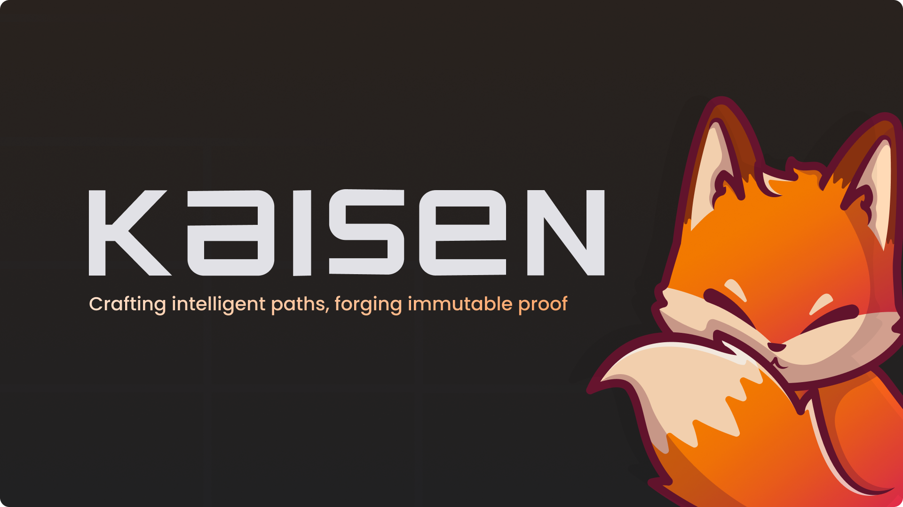
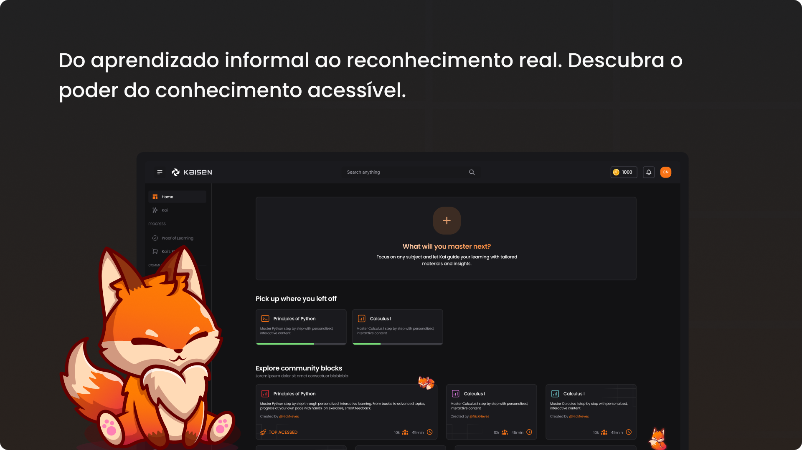
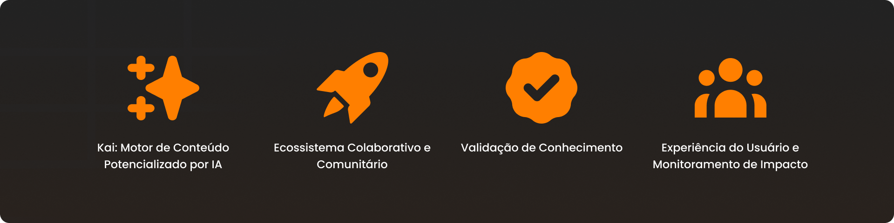
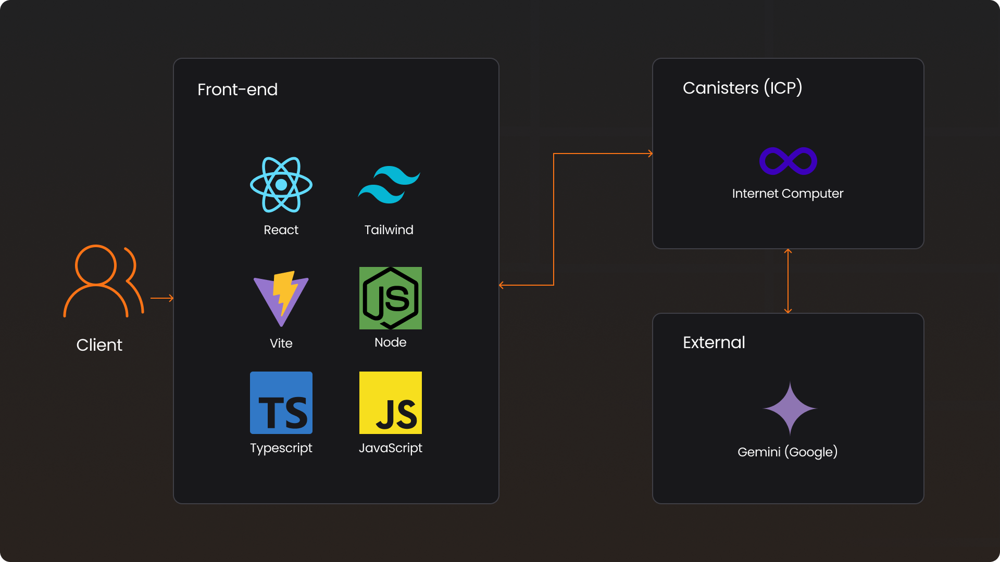

# KAISEN

<div align="center">



</div>

<p align="center">
  <a href="#solution-overview">Solution Overview</a> •
  <a href="#core-features">Core Features</a> •
  <a href="#technologies-used">Technologies Used</a> •
  <a href="#project-setup">Project Setup</a> •
  <a href="#data-storage-setup">Data Storage Setup</a> •
  <a href="#deploying-to-icp-mainnet">Deploying to ICP (Mainnet)</a> •
  <a href="#system-architecture">System Architecture</a> •
  <a href="#application-flows">Application Flows</a> •
  <a href="#demo">Demo</a> •
  <a href="#project-structure">Project Structure</a> •
  <a href="#conclusions-and-future-work">Conclusions and Future Work</a> •
  <a href="#development-team">Development Team</a> •
  <a href="#license">License</a>
</p>

> This README provides an overview of the Kaizen platform. For more detailed information about the application, please refer to the [wad.md](./documents/wad.md).

Kaisen proposes a new framework for acquiring and validating knowledge. It is a decentralized protocol that replaces the passive logic of content consumption with an active, intelligent, and community-driven learning experience.

Through the combination of artificial intelligence and collective curation, users build personalized learning paths, while the network itself validates and enhances the most effective routes to mastery. Individual progress is transparently recorded and recognized through NFT certificates, which securely, verifiably, and permanently attest to proficiency in specific skills.

More than just an educational platform, Kaisen lays the foundation for a decentralized, interoperable, and reputation-based knowledge infrastructure.

## Solution Overview

<div align="center">



</div>

The advancement of artificial intelligence has radically transformed access to knowledge. Tools like ChatGPT, YouTube, and online course platforms are empowering a new generation of autonomous learners — a movement growing rapidly, as highlighted by HolonIQ reports.

However, this revolution faces a structural limitation: the lack of reliable mechanisms to authenticate learning acquired outside of traditional institutions.

Kaisen was created to bridge this gap. It combines artificial intelligence, collective curation, and decentralized infrastructure to transform individual learning journeys into verifiable records. Each path is built with AI support, validated by the community, and registered as NFT certificates that securely, auditably, and interoperably prove the real competencies acquired by each user.

## Core Features

<div align="center">



</div>

### 1. Kai - AI-Powered Content Engine

Kai is the intelligent core of Kaisen, designed to turn any information source into a structured and meaningful learning experience:

- **Interactive & Contextual Chat**: Acts as an overlay tutor, allowing users to input topics, links, or documents (e.g. PDFs) to start a learning journey.
- **Automated Path Generation**: Builds personalized tracks with quizzes, flashcards, mind maps, and summaries.
- **Incentivized Smart Curation**: Evaluates the quality of generated paths and suggests publishing them to the community — high-quality contributions are rewarded with $KOIN tokens.
- **Modular Visual Editing**: Users can visually rearrange and edit content through an intuitive block/card interface.

---

### 2. Collaborative & Community Ecosystem

Kaisen is not just a platform — it’s a living ecosystem where knowledge evolves through collective intelligence:

- **Community Feed**: Explore published learning paths, track trends, and engage with other learners.
- **Knowledge Forking**: Any public path can be forked, allowing others to adapt, enhance, or expand it.
- **Integrated Contextual Forums**: Discussions, feedback, and debates are embedded directly within content modules.

---

### 3. Knowledge Validation & Reputation (Proof-of-Learning)

Kaisen introduces a reliable infrastructure to authenticate acquired skills, replacing generic certificates with immutable technical proof:

- **NFT Certificates**: Completing a track generates an NFT that verifiably proves mastery.
- **Social Recognition**: NFT credentials can be shared on LinkedIn and other networks, with verified blockchain authenticity.
- **Incentivized Sharing**: Users are rewarded with $KOIN tokens for promoting their earned credentials.

---

### 4. User Experience & Impact Monitoring

The user journey is carefully designed to maximize clarity, autonomy, and long-term value:

- **Universal User Profile**: A personal hub aggregating created tracks, earned NFTs, preferences, and history.
- **Content Creator Dashboard**: Insightful metrics on views, forks, and rewards for each created learning path.
- **Guided Onboarding**: An interactive tutorial walks new users through the full platform potential step-by-step.

## Technologies Used

<div align="center">


</div>

### Languages & Frameworks

- **Motoko** – Native language for Internet Computer, used to build decentralized backend canisters.
- **TypeScript** – Statically typed JavaScript superset used for frontend scalability.
- **JavaScript** – Browser-side logic and library interoperability.
- **React** – Declarative library for building reactive modular UIs.
- **Vite.js** – A modern front-end build tool optimized for frameworks like React, with instant startup and fast loading during development.

### UI & Styling

- **Tailwind CSS** – Utility-first CSS framework for fast, responsive design.
- **CSS** – Custom styling support on top of Tailwind.

### Web3 & Internet Computer

- **DFX** – CLI tool for building, testing, and deploying canisters.
- `@dfinity/agent`, `@dfinity/candid`, `@dfinity/auth-client`, `@dfinity/ledger-icp`, `@dfinity/principal`, `@dfinity/utils` – Official DFINITY libraries for agent communication, authentication, serialization, and identity handling.

### Identity & Integrations

- **@nfid/identitykit** – NFID-based authentication as an alternative to Internet Identity.
- **Gemini API (Google)** – Integration with generative AI for content creation (summaries, quizzes, etc.).

### DevTools & Infrastructure

- **TypeScript 5** – Modern features and type safety.
- **dotenv** – Environment variable management.
- **path (Node.js)** – File path manipulation utility.

## Project Setup

<div align="center">


</div>

### Requirements

| OS              | Requirements                                                      |
| --------------- | ----------------------------------------------------------------- |
| **Linux/macOS** | Node.js 22.x, DFX CLI, Git, Gemini API key                               |
| **Windows**     | WSL 2 with Ubuntu 20.04+, Node.js 22.x (inside WSL), DFX CLI, Git |

> ⚠️ **Note**: DFX runs only on Linux/macOS. Windows users must use WSL (Windows Subsystem for Linux).

---

### Installation Guide

#### 💻 Linux/macOS

1. Clone the repository and access the folder:

```bash
git clone https://github.com/KaisenOrg/kaisen.git
cd kaisen
```
2. Grant permission to the script and run:

```bash
chmod +x setup.sh
./setup.sh
```

The script automatically performs the following steps:
> Tip: Run `dfx identity get-principal` to get your ID

- Creates the `env.mo` file with the provided data
- Requests your **Gemini API key**
- Starts DFX (`--background --clean`)
- Creates, compiles, generates, and deploys all canisters
- Requests your **ICP Principal ID**
- Deploys the `icrc1_ledger` canister with the correct parameters

#### 🪟 Windows (via WSL)

1. Install WSL 2 (Microsoft Official Guide)

2. Use Ubuntu 20.04+ from Microsoft Store

3. Open the WSL terminal and run:

```bash
sudo apt update && sudo apt upgrade -y

# Install Node.js 22.x
curl -fsSL https://deb.nodesource.com/setup_22.x | sudo -E bash -
sudo apt install -y nodejs build-essential

# Install DFX (Internet Computer SDK)
sh -ci "$(curl -fsSL https://internetcomputer.org/install.sh)"

# Install Git and dos2unix
sudo apt install git dos2unix

git clone https://github.com/KaisenOrg/kaisen.git
cd kaisen

# Fix line endings (required if inside /mnt/c/...)
dos2unix setup.sh

chmod +x setup.sh
./setup.sh
```

> ⚠️ Important: If you cloned the project in a Windows directory (e.g., /mnt/c/...), running `dos2unix setup.sh` is required to avoid execution errors like:
> -bash: ./setup.sh: cannot execute: required file not found

**Check:** Run `npm run dev` and visit http://localhost:5173 to view the running app or enter the kaisen_frontend link returned by setup.sh.

### Data Storage Setup

> ⚠️This project does not use a traditional relational database. All data storage is decentralized and handled through Internet Computer canisters.

#### 📦 Storage Structure

- Canisters written in Motoko store persistent application state and logic.

- User data (tracks, certificates, tokens) is kept directly inside canisters and accessed via authenticated calls.

- Frontend communicates via @dfinity/agent using the Candid interface.

#### 🔐 Architecture Benefits

- **Fully decentralized:** No external databases or cloud servers required.

- **Automatic persistence:** Handled natively by the ICP protocol.

- **Built-in security:** Identity, isolation, and data integrity by design.

## Deploying to ICP Mainnet

<div align="center">


</div>

### Prerequisites

- Internet Identity account

- ICP Wallet with sufficient cycles

- DFX CLI installed and authenticated

### Deployment Steps

```bash
dfx identity new <your-identity>  # only if needed
dfx identity use <your-identity>
dfx identity get-principal
dfx wallet --network ic
dfx build --network ic
dfx deploy --network ic
```

### Mainnet Canister IDs

- `kaizen_frontend`: `NOT RELEASED YET`
- `kai_backend`: `NOT RELEASED YET`
- `tracks_backend`: `NOT RELEASED YET`
- `nft_certificates`: `NOT RELEASED YET`
- `chats_backend`: `atduo-raaaa-aaaab-abqbq-cai`
- `icrc1_ledger`: `aigil-lyaaa-aaaab-abqda-cai`

## System Architecture

<div align="center">


</div>

The diagram below provides a simplified overview of Kaizen’s architecture. Users interact with a modern interface built using React and Vite.js, styled with Tailwind CSS, and developed with TypeScript and JavaScript. This front-end layer communicates directly with canisters hosted on the Internet Computer (ICP), which serve as the decentralized back-end of the application. Additionally, these canisters integrate with external services such as the Gemini API to generate content through artificial intelligence, ensuring a dynamic and personalized experience.

<div align="center">



</div>

> For more detailed information about the architecture diagram, please refer to the [wad.md](./documents/wad.md).

## Application Flows

<div align="center">


</div>

### Personal Learning Flow (Private Use)

1. The user accesses the platform and completes the guided onboarding.
2. Through the Kai assistant, the user submits a topic, link, or PDF.
3. Kai generates a personalized learning path with quizzes, summaries, flashcards, and mind maps.
4. The user studies the content at their own pace and tracks their progress.
5. Upon completion, a verifiable NFT certificate is issued and stored in the user’s profile.

---

### Community Publishing Flow (Public Contribution)

1. After creating a learning path, the user can edit and refine the content visually.
2. Kai evaluates the educational value of the path and suggests publishing it.
3. The user chooses to publish the path in the community feed.
4. Other users can explore, fork, or enhance the published path.
5. The original creator earns visibility, engagement metrics, and may receive $KOIN token rewards.

---

> 📝 These flows reflect Kaisen's hybrid design: empowering personal learning journeys while nurturing a collaborative knowledge ecosystem. Access Figma at the following link: [high-fidelity prototype](https://www.figma.com/design/qPsCtf4GvgwH6cmUgdy7Q8/Kaisen--WCHL-?node-id=11-55&p=f&t=mlAWH3cQRxuj6eXQ-0)

## Demo

Access the materials below, which include the demo video and pitch deck, to gain a more complete understanding of the project—from its proposal and technical operation to the strategic vision of the solution.

- 🎥 [Demo Video (with walkthrough and architecture overview)](https://youtu.be/gB6UmWj5Ihc)
- 🖼️ [Pitch Deck and Presentation (problem, solution, roadmap)](https://www.youtube.com/watch?v=nTzzAbid1Ig)

## Project Structure

<div align="center">


</div>

Among the files and folders present in the project root, the following are defined:

- **document:** This contains all project documents, such as the Web Application Document (WAD), as well as supplementary documents.

- **frontend:** Folder containing files related to the user interface, developed with React, Tailwind, and Vite.js.

- **backend:** Folder responsible for business logic and data persistence, implemented in canisters on the Internet Computer (ICP).

- **dfx.json:** DFINITY configuration file that defines the canisters, their dependencies, and other instructions necessary for deployment on the Internet Computer.

- **.gitignore:** Specifies to Git which files or folders should not be included in versioning.

- **README.md:** File that serves as an introductory guide and general explanation of the project and application (the same file you are reading now).

## Conclusions and future work

<div align="center">


</div>

Kaizen is consolidating itself as a collaborative and decentralized learning platform, allowing users to explore and share knowledge openly and securely. To date, we have developed important features such as modular content organization, assistive chat, user profiles, and progress tracking.

During development, we faced challenges related to integrating with blockchain technology and ensuring a seamless user experience. However, these obstacles are designed to improve the platform's structure and usability.

For the next steps, our main goals include implementing a tokenized rewards system, which aims to encourage user engagement, and developing decentralized governance, allowing the community itself to participate in decisions regarding platform developments.

Another planned advancement is the introduction of the trail fork functionality. With this feature, users will be able to duplicate an existing trail, customize it according to their interests, and, if desired, contribute to the original trail. This strengthens collaboration, personalized learning, and a sense of belonging to the community.

Finally, we remain committed to continuous improvements in usability, accessibility, and integration with new technologies, making Kaizen increasingly efficient, inclusive, and relevant for all audiences.

## Development Team

<div align="center">


</div>

- [Giovanna Neves Rodrigues](https://github.com/GigicaNeves)
- [José Antônio Ferreira de Lima](https://github.com/jlimaz)
- [Marcus Felipe dos Santos Valente](http://github.com/m4rcusml)
- [Messias Fernandes de Olivindo](https://github.com/Messias-Olivindo)
- [Nicole Riedla Paiva Neves](https://github.com/nicriedla)

## License

<div align="center">


</div>

This project is licensed under the terms of the [Apache License 2.0](https://choosealicense.com/licenses/apache-2.0/).  
You are free to use, modify, and distribute this software — including for commercial purposes — as long as you retain the copyright notices and attribution.

> See the [LICENSE](./LICENSE) file for more details.
