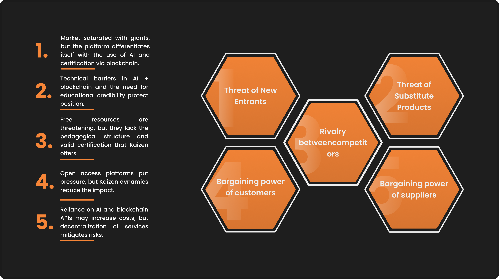
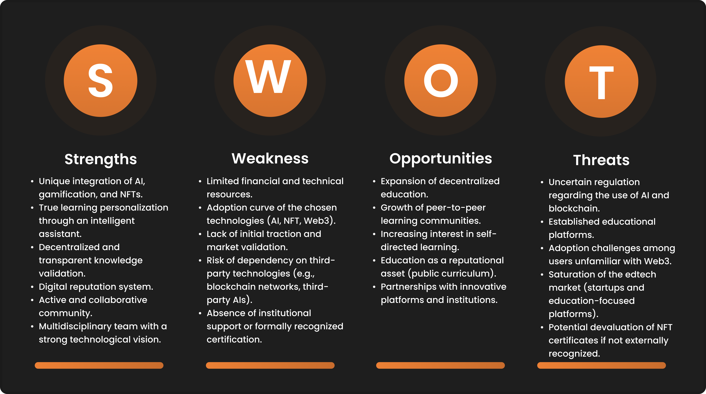
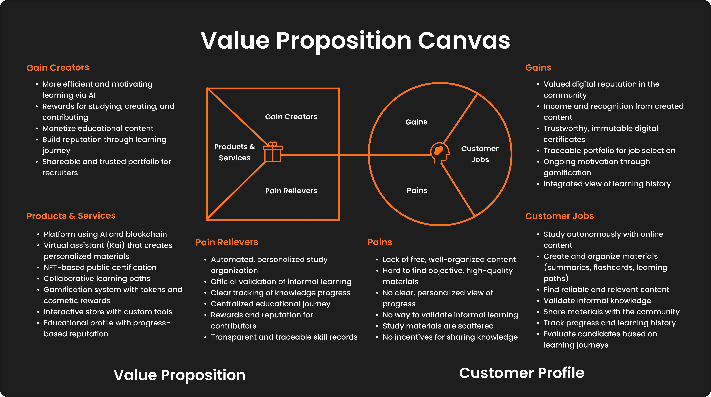
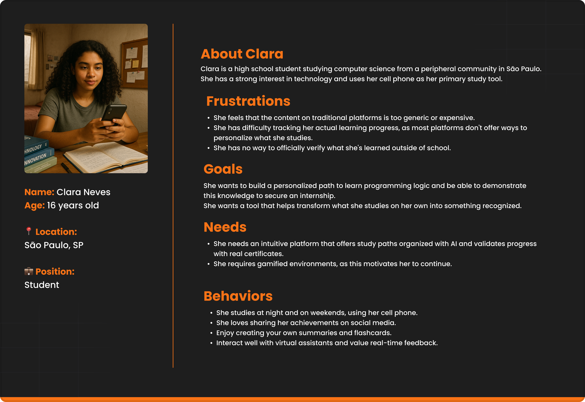
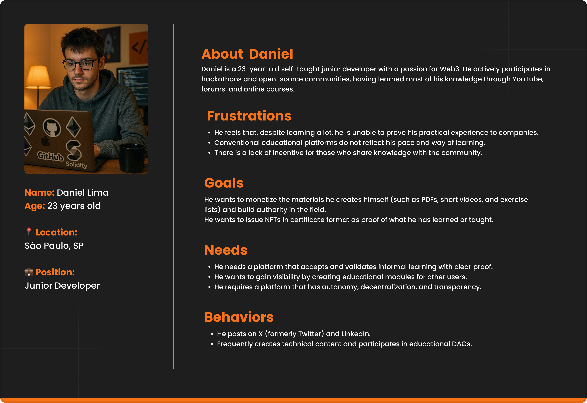
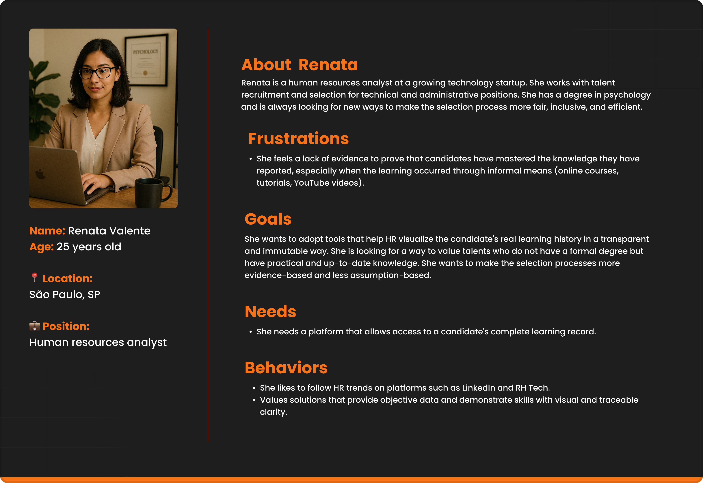

# Kaizen

## Group Name: [FILL IN GROUP NAME]

#### Group Members' Names:

[FILL IN MEMBER NAME]

## Table of Contents

  
<a href="#1-introduction">1. Introduction</a>

  
<a href="#2-application-overview">2. Application Overview</a>

  <ul>
    <li>
      <a href="#21-project-scope">2.1. Project Scope</a>
      <ul>
        <li><a href="#211-porter-5-forces-model">2.1.1. Porter's 5 Forces Model</a></li>
        <li><a href="#212-swot-analysis-of-partner-institution">2.1.2. SWOT Analysis of Partner Institution</a></li>
        <li><a href="#213-solution">2.1.3. Solution</a></li>
        <li><a href="#214-value-proposition-canvas">2.1.4. Value Proposition Canvas</a></li>
        <li><a href="#215-project-risk-matrix">2.1.5. Project Risk Matrix</a></li>
      </ul>
    </li>
    <li><a href="#22-personas">2.2. Personas</a></li>
  </ul>

  
<a href="#3-application-project">3. Application Project</a>

  <ul>
    <li><a href="#31-architecture-diagram">3.1. Architecture Diagram</a></li>
    <li><a href="#32-style-guide">3.2. Style Guide</a></li>
    <ul>
      <li><a href="#321-colors">3.2.1. Colors</a></li>
      <li><a href="#322-typography">3.2.2. Typography</a></li>
      <li><a href="#323-iconography-and-images">3.2.3. Iconography and Images</a></li>
    </ul>
    <li><a href="#33-high-fidelity-prototype">3.3. High-Fidelity Prototype</a></li>
    <li><a href="#34-data-modeling-on-chain">3.4. Data Modeling (On-Chain)</a></li>
    <ul>
      <li><a href="#341-smart-contracts-logic-on-chain">3.4.1. Smart Contracts Logic (On-Chain)</a></li>
    </ul>
  </ul>

  
<a href="#4-application-development">4. Application Development</a>

  <ul>
    <li><a href="#41-first-version-of-the-application-mvp">4.1. First Version of the Application (MVP)</a></li>
  </ul>

  
<a href="#5-market-study-and-marketing-plan">5. Market Study and Marketing Plan</a>

  <ul>
    <li><a href="#51-executive-summary">5.1. Executive Summary</a></li>
    <li><a href="#52-market-analysis">5.2. Market Analysis</a></li>
    <li><a href="#53-competitive-analysis">5.3. Competitive Analysis</a></li>
    <li><a href="#54-target-audience">5.4. Target Audience</a></li>
    <li><a href="#55-positioning">5.5. Positioning</a></li>
    <li><a href="#56-marketing-strategy">5.6. Marketing Strategy</a></li>
  </ul>

  
<a href="#6-conclusions-and-future-work">6. Conclusions and Future Work</a>

  
<a href="#7-references">7. References</a>

  
<a href="#8-appendices">8. Appendices</a>

# 1. Introduction

Kaizen is a decentralized educational platform that transforms the way individuals learn, share, and validate knowledge. By integrating artificial intelligence and blockchain technology, the application offers an innovative and continuous experience in which the user not only studies in a personalized way but also publicly proves their progress through immutable digital certifications.

In practice, the process begins when the user sends content such as PDFs, notes, or articles directly to Kai—the platform's intelligent virtual assistant. From this material, Kai generates interactive flashcards, quizzes, summaries, and personalized study paths, facilitating targeted and efficient learning. Upon completing their study journey, the user can validate the knowledge acquired through an NFT certificate, which reliably and transparently attests to their mastery of the studied content.

In addition, Kaizen promotes knowledge sharing, where the user, after completing their paths, can make them publicly available with the content they studied, allowing other people to benefit from the path taken. To further enrich this exchange, community members can suggest complementary materials to existing trails, while the trail creator maintains the autonomy to accept all, some, or none of the contributions. This promotes active curation and ensures the quality of shared resources.

Aiming to encourage constant engagement, the application rewards users for each significant interaction—whether it be answering a question correctly, completing a trail, or contributing relevant content. These accumulated tokens can be used in Kai's Shop, an interactive and playful environment where it is possible to unlock variations of the mascot (with personalized looks and skins), as well as exclusive tools that enhance learning and the creation of new content.

In this way, Kaizen establishes itself as an intelligent and collaborative study environment—in which each achievement is recorded, each contribution is valued, and knowledge is transformed into digital reputation, social recognition, and tangible rewards.

# 2. Application Overview

## 2.1. Project Scope

### 2.1.1. Porter's 5 Forces Model

The education industry faces growing challenges, such as the low quality of teaching and the difficulty of reliably proving learning. According to UNESCO, millions of young people still do not have access to adequate education, while the job market evolves rapidly and demands constant professional development. In addition, the lack of effective means—digital or physical—to validate knowledge hinders the advancement of many individuals.

In this context, Kaizen emerges as an innovative solution by combining artificial intelligence and blockchain to personalize learning and ensure the secure validation of knowledge through immutable digital certificates (NFTs). By facilitating learning, transparent certification, and collaborative sharing, Kaizen offers an effective alternative to the limitations of the traditional education model, expanding access and trust in the educational process.

In this scenario, Porter's Five Forces analysis is applied—an essential tool for assessing the competitive environment and understanding the factors that influence the dynamics of the sector.

Figure X - Porter's 5 Forces Model

Source: Material produced by the authors (2025)

**Competitor Rivalry – High** 
The online education platform market is booming, driven by giants such as Coursera, Udemy, Duolingo, and Khan Academy, which reach millions of users around the world. This diversity of alternatives increases the competition for attention and engagement. To differentiate itself in this scenario, Kaizen adopts a unique proposal: it combines personalized artificial intelligence with immutable validation of knowledge via blockchain. This approach creates a qualitative barrier that reduces the direct impact of traditional competition and positions the platform as a reference in educational innovation.

**Threat of new entrants – Moderate** 
The threat of new entrants is moderate because, despite the ease of entry into the digital sector, developing a platform that integrates AI, blockchain, gamification, and knowledge validation requires technical expertise, investment in infrastructure, and educational credibility. These requirements create technological and trust barriers, thus making it difficult for new participants with similar proposals to enter and protecting the position of the Kaizen platform in the market.

**Threat of substitute products – High** 
The threat of substitute products is high, as users may opt for informal solutions, such as YouTube videos, e-books, forums, or free podcasts. These alternatives, although accessible, lack pedagogical structure, valid certification, and engagement mechanisms. To overcome this scenario, the Kaizen platform relies on a personalized learning journey based on artificial intelligence and the immutable validation of knowledge through NFTs—a significant differentiator that is not easily replicable by traditional or informal substitutes.

**Bargaining power of customers – High** 
Given the wide range of free or low-cost educational resources available, users have a high level of choice and demand clear value in their decisions. To reduce this pressure, Kaizen invests in the user experience by offering a gamified, transparent platform focused on digital reputation through certified NFTs. This value proposition strengthens loyalty, increases engagement, and transforms the user into an active agent in their own educational development.

**Supplier Bargaining Power – Moderate** 
Dependence on external technological infrastructure and tools—such as AI APIs and blockchain networks—can increase suppliers’ bargaining power and impact operating costs. To mitigate this risk, Kaizen adopts a service decentralization strategy, prioritizing scalable, interoperable solutions that allow flexibility in choosing partners. With this, the platform ensures technical autonomy and greater resilience in the face of fluctuations in the supplier market.

### 2.1.2. SWOT Analysis of Partner Institution

The SWOT analysis is a widely used tool for planning and mapping out various solutions. It helps in understanding how a company, brand, product, or service positions itself in the market by identifying its strengths and weaknesses (internal factors), as well as opportunities and threats (external factors). Below is the analysis of the developed solution.

Figure X - Swot Analysis Model

Source: Material produced by the authors (2025)

**Strengths:** 

- Unique integration of AI, gamification, and NFTs.
- True learning personalization through an intelligent assistant.
- Decentralized and transparent knowledge validation.
- Digital reputation system.
- Active and collaborative community.
- Multidisciplinary team with a strong technological vision.

**Weaknesses:** 

- Limited financial and technical resources.
- Adoption curve of the chosen technologies (AI, NFT, Web3).
- Lack of initial traction and market validation.
- Risk of dependency on third-party technologies (e.g., blockchain networks, third-party AIs).
- Absence of institutional support or formally recognized certification.

**Opportunities:** 

- Expansion of decentralized education.
- Growth of peer-to-peer learning communities.
- Increasing interest in self-directed learning.
- Education as a reputational asset (public curriculum).
- Partnerships with innovative platforms and institutions.

**Threats:** 

- Uncertain regulation regarding the use of AI and blockchain.
- Established educational platforms.
- Adoption challenges among users unfamiliar with Web3.
- Saturation of the edtech market (startups and education-focused platforms).
- Potential devaluation of NFT certificates if not externally recognized.

The SWOT analysis of the Kaizen platform highlights a project with high innovative potential, supported by a differentiated value proposition that integrates Artificial Intelligence, gamification, and decentralized validation through NFTs. Its main strengths lie in the personalization of learning, community engagement, and the construction of digital reputation, all aligned with emerging trends in education and Web3.

However, the project faces challenges related to its internal structure and the current maturity level of the market. The lack of initial traction and market validation, combined with the adoption curve of the technologies involved, presents real obstacles to widespread expansion and user acceptance. The limited availability of technical and financial resources, along with the absence of formally recognized institutional certification, reinforces the need for a solid market entry strategy that prioritizes ease of use, real-user testing, and strategic partnerships.

External opportunities are clear, especially with the growing value placed on self-directed learning, digital reputation, and collaborative communities. Nonetheless, the project must overcome threats such as the saturation of the edtech market, skepticism toward technologies like NFTs, and increasing regulatory pressure on AI and blockchain.

Therefore, to ensure the sustainability of the solution, it is essential to validate it within specific niches, modularize its technological complexity, and develop a marketing plan that clearly communicates its unique value in an accessible, user-focused manner.

### 2.1.3. Solution

**Problem to be solved:**   
The traditional educational model is centralized, expensive, and inefficient in providing detailed and verifiable proof of individual knowledge. Furthermore, the certificates currently used are fragile, and learning is treated as a product rather than a collaborative ecosystem. Consequently, there is a lack of effective mechanisms for validating knowledge, as well as limited incentives for sharing and collaboration within the community.

**Available data:**   
The platform offers a wide variety of educational content, available in various formats, such as PDFs, articles, research papers, and technical documentation. Furthermore, relevant data is collected, such as user learning patterns and preferences, community engagement metrics, and blockchain-based validation records. It is worth noting that the platform utilizes both user-generated content and learning materials processed by artificial intelligence (AI), thus creating a comprehensive and dynamic knowledge repository.

**Proposed solution:**   
Kaizen is the first decentralized knowledge protocol that transforms learning—once a passive consumption process—into a creative, collaborative, and valuable experience. The solution combines personalized learning paths with AI technologies and blockchain validation, creating a true “GitHub of Knowledge.”

Users input raw materials (such as PDFs, topics, and links), which are processed by Kai, an AI assistant. Kai, in turn, generates personalized learning paths. These paths can be published, forked, and improved by the community, resulting in a living, constantly evolving repository, validated by NFT certificates and incentivized by the $KOIN token economy.

**How to use the solution:**   
- Content Input: The user submits documents or defines topics of interest to Kai.
- Path Generation: The AI creates personalized paths containing quizzes, flashcards, and interactive content.
- Learning Process: Users progress through the paths with the support of the AI tutor.
- Community Collaboration: Upon completion, paths can be published and improved by the community through forking.
- Validation: Completion of the learning process is certified by “mineable” NFTs, serving as proof of learning.
- Incentive: Users are rewarded with $KOIN tokens for creating quality content, completing paths, and collaborating with the community.

**Expected benefits:**  
- Democratization of access to personalized, AI-driven education.
- Verifiable and portable knowledge credentials, secured by blockchain certificates.
- Creation of a collaborative knowledge ecosystem, with content continuously improved by the community.
- Establishment of a sustainable incentive model that values learning and sharing.
- Reduction of educational costs and expansion of access to education.
- Strengthening digital reputation and professional recognition through certified achievements.

**Success criteria and how it will be evaluated:**  
- User Engagement: Measured by the number of paths created, completed, and forked monthly.
- Community Growth: Assessed based on the number of active users and retention rate (goal: over 5,000 active users in the first year).
- Knowledge Quality: Verified through community reviews and engagement metrics for published tracks.
- Certification Adoption: Quantified by the number of NFT certificates issued and shared in professional contexts.
- Token Economy Health: Monitored based on the circulation of the $KOIN token, adoption of staking mechanisms, and market activity.
- Educational Impact: Assessed by measuring improvements in user knowledge and skills through pre- and post-assessments.

### 2.1.4. Value Proposition Canvas

The Value Proposition Canvas is a strategic tool used by various companies with the objective of deeply understanding the needs, pains, and desires of their customers, while simultaneously aiming to create and position the offered product or service according to those demands. Based on this, the following is the Value Proposition Canvas of the Kaizen solution, which presents a well-defined customer profile and a clear description of how the proposed solution aligns with it.

Figure X - Value Proposition Canvas

Source: Material produced by the authors (2025)

**Customer Jobs:** 

- Study autonomously using online content.
- Create and organize their own study materials (summaries, flashcards, learning paths).
- Search for reliable and relevant materials aligned with their goals.
- Officially validate knowledge acquired through informal means.
- Share knowledge and materials with others.
- View their progress and learning history in a clear and personalized way.
- Evaluate and select candidates based on real and evidenced learning journeys.

**Pains:** 

- Lack of free, logically or chronologically organized study content.
- Difficulty finding high-quality, objective materials.
- Absence of a clear and personalized overview of study progress.
- Inability to officially validate informal learning.
- Lack of centralization of study materials across different fields of knowledge.
- Lack of incentive for those who share knowledge with the community.

**Gains:** 

- Creation of a valued digital reputation through an active community.
- Income generation and recognition through created content and learning paths.
- Transparent, trustworthy, and immutable digital certificates that validate knowledge.
- A solid, traceable portfolio for use in selection processes.
- Continuous motivation through gamification and rewards.
- Integrated and clear view of any individual's learning history.

**Products & Services:** 

- Decentralized educational platform integrating AI and blockchain.
- Intelligent virtual assistant (Kai) that transforms any material into flashcards, summaries, quizzes, and personalized study paths.
- Digital certification via NFT with public and immutable validation.
- Public learning paths with possibilities for collaboration and community curation.
- Gamification system with rewards in tokens and cosmetic items.
- Interactive store with customizations and additional tools.
- Traceable educational profile with reputation linked to progress and collaboration.

**Pain Relievers:** 

- Automated and personalized organization of studies based on the user’s own materials.
- Official validation of informal learning without dependence on traditional institutions.
- Clear and continuous visualization of knowledge evolution.
- Tools to centralize and document the entire educational journey.
- Tangible incentives for those who contribute to the community (rewards and reputation).
- Transparency and traceability in recording competencies and learning.

**Gain Creators:** 

- More efficient, personalized, and motivating study experience supported by AI.
- Rewards for every meaningful interaction: studying, creating, contributing.
- Possibility to monetize one’s own educational content.
- Recognition of the educational journey as a reputation-building asset.
- Shareable educational portfolio for recruiters in an objective and reliable format.

The analysis conducted through the Kaizen Value Proposition Canvas demonstrates not only a clear understanding of the target audience’s pains and expectations but also a consistent plan to offer a functional and strategic response to these demands. The proposal is anchored in technological differentiators, such as the integration of AI, blockchain, and NFT certifications. However, the most relevant aspect of the proposal lies in the platform’s ability to convert informal learning into verifiable reputation, a feature still rarely explored consistently in the educational market.

Therefore, it is worth emphasizing that the solution addresses a real and pressing issue: the disconnect between knowledge acquired through non-traditional means and its validation. The centralization of learning data, personalization of the study process, and the possibility of monetizing and sharing educational journeys add direct value to the end user. Kaizen does not merely rely on emerging technologies; it builds an ecosystem in which knowledge is treated as a reputational asset—traceable, shareable, and, most importantly, rewardable.

### 2.1.5. Project Risk Matrix

[FILL IN - Place here the risk matrix]

## 2.2. Personas

Representing specific individuals, personas are semi-fictional profiles built based on real data and observations about the target audience. Their main function is to facilitate the understanding of users' needs, behaviors, and motivations, allowing for more targeted and effective solution development.

Below are three personas developed specifically for this project to guide decision-making and ensure greater alignment with end-user expectations.

Figure X - Persona 1

Source: Material produced by the authors (2025)

She represents an ambitious young student from a peripheral community who sees technology as a path to new opportunities. As a technical high school student studying Computer Science in the outskirts of São Paulo, she embodies the self-taught learner, using mobile technology as an ally in her educational journey. Clara's persona highlights the importance of accessible and personalized learning, capable of transforming informal study into recognized credentials—a key challenge for students seeking to demonstrate their competencies beyond traditional academic settings.

Figure X - Persona 2

Source: Material produced by the authors (2025)

He personifies the modern self-taught developer who stands out in the Web3 ecosystem. At 23, this junior developer represents a growing community of professionals who have honed their skills through alternative learning paths—such as YouTube tutorials, contributions to open-source projects, and participation in hackathons. His persona highlights the gap between practical knowledge and formal recognition, while also symbolizing the creative economy, in which educational content producers seek to generate impact and monetize their knowledge.

Figure X - Persona 3

Source: Material produced by the authors (2025)

She represents the progressive HR professional working in a constantly changing talent landscape, especially in technology startups. As an HR analyst with a background in Psychology, she faces the daily challenge of evaluating candidates whose most relevant skills were often acquired through non-traditional learning paths. Her persona highlights the modern recruiter's dilemma: how to fairly recognize and validate informal learning while developing more inclusive, evidence-based selection processes capable of identifying talent beyond formal educational credentials.

# 3. Application Project

## 3.1. Architecture Diagram

[FILL IN - Place here the architecture diagram]

## 3.2. Style Guide

[FILL IN - Describe here general guidelines about colors, fonts, icons and images for the Kaizen application.]

### 3.2.1. Colors

[FILL IN - Present here the color palette.]

### 3.2.2. Typography

[FILL IN - Present here the typography of the solution.]

### 3.2.3. Iconography and Images

[FILL IN - Present here the icons and images.]

## 3.3. High-Fidelity Prototype

[FILL IN - Place here the prototype screens]

## 3.4. Data Modeling (On-Chain)

### 3.4.1. Smart Contracts Logic (On-Chain)

**Certificate Contract (ERC-721 or ERC-1155 Standard):**
Main Function:
Description:
Validation:
**Token Contract (ERC-20 Standard):**
Token Name:
Main Functions:
Reward Logic:

# 4. Application Development

## 4.1. First Version of the Application (MVP)

[FILL IN - Describe and illustrate here what was delivered in the MVP, such as Front-end functionalities and initial integrations.]

# 5. Market Study and Marketing Plan

## 5.1. Executive Summary

[FILL IN]

## 5.2. Market Analysis

[FILL IN THE SUBSECTIONS WITH MARKET RESEARCH]

## 5.3. Competitive Analysis

**a) Main Competitors:**
Direct: [FILL IN]
Indirect: [FILL IN]
**b) Competitive Advantages of the Web Application:**
[FILL IN]

## 5.4. Target Audience

**a) Market Segmentation:** [FILL IN]
**b) Target Audience Profile:** [FILL IN - Characterize the target audience with demographic, psychographic and behavioral data.]

## 5.5. Positioning

**a) Unique Value Proposition:** [FILL IN]
**b) Differentiation Strategy:** [FILL IN - Explain how your application stands out from the competition.]

## 5.6. Marketing Strategy

[FILL IN THE SUBSECTIONS WITH DIGITAL MARKETING STRATEGY]

# 6. Conclusions and Future Work

[FILL IN - Write how the web application solution achieved the objectives described in section 2 of this document. Indicate strengths and areas for improvement in general.]

# 7. References

[FILL IN - Include the main references of your project]

# 8. Appendices

[FILL IN - Include here any complements to your project, such as diagrams, images, tables, etc.]
