

  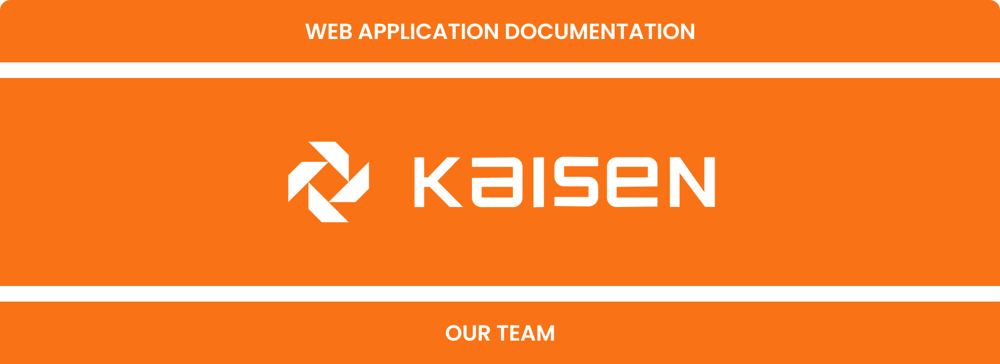 

<table align="center" style="border: none; border-collapse: collapse;">
  <tr>
    <td style="border: none;"></td>
    <td style="border: none; padding: 1;"></td>
    <td style="border: none; padding: 1;"></td>
  </tr>
</table>

## Índice

<a href="#1-introduction">1. Introdução</a>

<a href="#2-application-overview">2. Visão geral do aplicativo</a>

  <ul>
    <li>
<a href="#21-project-scope">2.1. Escopo do Projeto</a>
      <ul>
<li><a href="#211-porter-5-forces-model">2.1.1. Modelo das 5 Forças de Porter</a></li>
<li><a href="#212-swot-analysis-of-partner-institution">2.1.2. Análise SWOT da Instituição Parceira</a></li>
<li><a href="#213-solution">2.1.3. Solução</a></li>
<li><a href="#214-value-proposition-canvas">2.1.4. Tela de proposta de valor</a></li>
<li><a href="#216-business-model-canvas">2.1.5. Tela de modelo de negócios</a></li>
      </ul>
    </li>
<li><a href="#22-personas">2.2. Personagens</a></li>
  </ul>

<a href="#3-application-project">3. Projeto de Aplicação</a>

  <ul>
<li><a href="#31-architecture-diagram">3.1. Diagrama de Arquitetura</a></li>
<li><a href="#32-style-guide">3.2. Guia de estilo</a></li>
    <ul>
<li><a href="#321-colors">3.2.1. Cores</a></li>
<li><a href="#322-typography">3.2.2. Tipografia</a></li>
<li><a href="#323-iconography-and-images">3.2.3. Iconografia e Imagens</a></li>
    </ul>
<li><a href="#33-high-fidelity-prototype">3.3. Protótipo de alta fidelidade</a></li>
<li><a href="#34-data-modeling-on-chain">3.4. Modelagem de dados (on-chain)</a></li>
    <ul>
<li><a href="#341-smart-contracts-logic-on-chain">3.4.1. Lógica de contratos inteligentes (on-chain)</a></li>
    </ul>
  </ul>

<a href="#4-application-development">4. Desenvolvimento de Aplicativos</a>

  <ul>
<li><a href="#41-first-version-of-the-application-mvp">4.1. Primeira versão do aplicativo</a></li>
<li><a href="#42-second-version-of-the-application-mvp">4.2. Segunda versão do aplicativo</a></li>
  </ul>

<a href="#5-market-study-and-marketing-plan">5. Estudo de Mercado e Plano de Marketing</a>

  <ul>
<li><a href="#51-executive-summary">5.1. Resumo Executivo</a></li>
<li><a href="#52-market-analysis">5.2. Análise de Mercado</a></li>
<li><a href="#53-competitive-analysis">5.3. Análise Competitiva</a></li>
<li><a href="#54-target-audience">5.4. Público-alvo</a></li>
<li><a href="#55-positioning">5.5. Posicionamento</a></li>
<li><a href="#56-marketing-strategy">5.6. Estratégia de Marketing</a></li>
  </ul>

<a href="#6-conclusions-and-future-work">6. Conclusões e trabalhos futuros</a>

<a href="#7-references">7. Referências</a>

<a href="#8-appendices">8. Apêndices</a>

# 1. Introdução

Kaisen é uma plataforma educacional descentralizada que transforma a forma como as pessoas aprendem, coletam e validam conhecimento. Ao integrar inteligência artificial e tecnologia blockchain, o aplicativo oferece uma experiência inovadora e integrada, onde os usuários não apenas estudam de forma personalizada, mas também demonstram publicamente seu progresso por meio de certificações digitais imutáveis.

Na prática, o processo começa quando os usuários enviam conteúdos como PDFs, notas ou artigos diretamente para o Kai – assistente virtual inteligente da plataforma. A partir desse material, Kai gera flashcards interativos, questionários, resumos e roteiros de estudo personalizados, facilitando um aprendizado direcionado e eficiente. Ao concluir a jornada de estudos, o usuário pode validar os conhecimentos adquiridos por meio de um certificado NFT, que atesta de forma confiável e transparente o domínio do conteúdo do treinamento.

Além disso, Kaisen promove a partilha de conhecimento, onde os utilizadores, após completarem os seus percursos, podem disponibilizá-los publicamente com o conteúdo da formação, permitindo que outros beneficiem da jornada. Para enriquecer ainda mais este intercâmbio, os membros da comunidade podem contribuir com materiais suplementares para os trilhos existentes, enquanto o criador do trilho mantém a autonomia para aceitar todas, algumas ou nenhuma das contribuições. Isso promove a curadoria ativa e garante a qualidade dos recursos compartilhados.

A comunidade Kaisen desempenha um papel central na colaboração e no envolvimento. Se um usuário precisar de ajuda para desenvolver uma trilha, ele poderá compartilhar sua solicitação com a comunidade por meio de uma postagem com apenas um clique. Essas reclamações são postadas tanto na área do posto quanto diretamente na própria trilha, mas deixam claro que a trilha está aberta para melhorias. Quando uma contribuição é feita, o criador da trilha pode avaliá-la e decidir se a aceita.

O sistema de recompensa simbólica incentiva a participação ativa. Os usuários acumulam tokens interagindo de forma significativa, seja respondendo perguntas corretamente, completando trilhas, contribuindo com conteúdo, ajudando outros usuários ou interagindo com a comunidade com feedback e sugestões. Além disso, você pode ganhar tokens recomendando uma plataforma a amigos por meio de um código único: novos usuários inserem esse código no momento do cadastro, garantindo que quem desejar recebê-lo receberá uma recompensa. As postagens na conta interna da plataforma no Twitter também ganham tokens, incentivando a publicidade e a participação social.

Kaisen também valoriza a construção de confiança digital e conexões entre os usuários. Você pode acessar os perfis de outros membros, visualizar suas postagens, faixas selecionadas, faixas publicadas e contribuições para a comunidade. Clicar no nome de um usuário em qualquer postagem abre seu perfil, facilitando a visualização de seu histórico e o acompanhamento de seu trabalho.

Por fim, para tornar o aprendizado mais divertido e motivador, os tokens ganhos podem ser usados ​​na Kai Store – um ambiente interativo onde você pode desbloquear opções de mascotes com skins exclusivas, além de ferramentas especiais para aprimorar a experiência de aprendizado e criação de conteúdo.

Dessa forma, Kaisen se estabelece como um ambiente de aprendizagem inteligente, colaborativo e gratificante – onde cada conquista é registrada, cada contribuição é valorizada e o conhecimento é transformado em recompensas, reconhecimento e recompensas reais.

# 2. Visão geral do aplicativo

## 2.1. Escopo do Projeto

### 2.1.1. Modelo das 5 Forças de Porter

O mercado de EdTech brasileiro, avaliado em US\$6 bilhões em 2025 com crescimento projetado de 11,12% CAGR até 2034, apresenta alta atratividade estratégica para o Kaisen apesar da intensa concorrência. Esta análise detalhada das Cinco Forças de Porter revela um cenário de rivalidade competitiva extremamente alta, em que a plataforma Alura domina com 1,2 milhão de usuários pagantes a R\$85/mês, DIO possui 500 mil usuários no plano Pro de R\$59/mês com parcerias de emprego, Rocketseat atende 100 mil desenvolvedores premium a R\$183/mês e Udemy alcança 5 milhões de brasileiros com cursos individuais de R\$29-99.

A **ameaça de novos entrantes** é moderada-alta devido às baixas barreiras técnicas de entrada para plataformas simples. No entanto, a equipe interna de profissionais especializados para validação de conteúdos iniciais cria credibilidade técnica diferenciada, e o motor de Inteligência Artificial nativo do Kaisen estabelece uma vantagem competitiva significativa. Dados da Liga Ventures indicam que 70% das 425+ startups EdTech falham no primeiro ano por falta de tração comunitária, dando ao Kaisen uma janela de 18 meses de "moat" competitivo devido ao seu modelo focado em curadoria.

O **poder de barganha dos clientes** é muito alto. Diversos desenvolvedores usam alternativas gratuitas dominantes como YouTube (80% dos iniciantes), ChatGPT Edu (70% uso diário) e freeCodeCamp. O Kaisen mitiga essa pressão com um modelo freemium agressivo (criação de trilhas em texto ilimitadas grátis), preço 47% inferior à Alura (R$44,90 vs R$85), e IA que não apenas gera conteúdo, mas emite Certificados Digitais Autenticados para comprovar o conhecimento diretamente no histórico do usuário.

A **ameaça de substitutos** é alta, com produtos diretos como trilhas Alura (IA básica) e bootcamps DIO competindo contra alternativas indiretas gratuitas que capturam 80% do mercado. O Kaisen se posiciona oferecendo um modelo de marketplace de conhecimento (revenue share de 75% para criadores de trilhas pagas, superior aos 50% da Udemy) e uma dinâmica de colaboração inspirada no GitHub, com "forks" e melhorias comunitárias em trilhas de estudo.

Finalmente, o **poder de barganha dos fornecedores** é moderado. Embora as APIs de IA (como Google Gemini) e serviços de nuvem (AWS/GCP) representem grande parte dos custos variáveis operacionais, o mercado de inteligência artificial e infraestrutura em nuvem tornou-se altamente commoditizado. Isso oferece múltiplas alternativas com preços competitivos e sem "lock-in" tecnológico irreversível, permitindo ao Kaisen migrar de provedores (ex: trocar de LLM) sem impacto crítico nos custos.

### 2.1.2. Análise SWOT da Instituição Parceira

A análise SWOT do Kaisen revela um posicionamento estratégico sólido no nicho de tecnologia, com forças técnicas e de precificação que contrabalançam fraquezas operacionais iniciais, aproveitando oportunidades de mercado em expansão.

###### Forças (Strengths)

O preço da assinatura Pro do Kaisen representa 47% do valor da Alura e 76% do DIO Pro, criando uma barreira imediata contra concorrentes genéricos e acelerando a conversão do modelo freemium (projetada em 15-20%). A validação de conteúdos com profissionais qualificados garante credibilidade técnica. O modelo de revenue share de 75% para criadores de conteúdo estabelece um incentivo econômico poderoso, gerando um efeito de rede viral onde cada trilha monetizada atrai novos autores para a plataforma.

###### Fraquezas (Weaknesses)

A ausência de tração inicial coloca o Kaisen em desvantagem competitiva frente aos gigantes do mercado (Alura, DIO, Rocketseat), exigindo investimento agressivo de marketing para alcançar os primeiros 1.000 usuários freemium em 6 meses (CAC projetado de R$25/usuário). A dependência de APIs de IA para custos variáveis cria vulnerabilidade a flutuações de preço em escala, impactando as margens brutas nos primeiros 12 meses. O controle interno de validação carece, no momento zero, do peso de uma marca institucional de ensino superior.

###### Oportunidades (Opportunities)

O mercado tech brasileiro é impulsionado por 200 mil vagas anuais, onde apenas 30% dos desenvolvedores possuem certificação formal. Isso cria uma demanda imediata por trilhas acessíveis e atestados de proficiência ágeis. A integração da IA generativa na educação favorece o modelo do Kaisen, alinhando-se perfeitamente à evolução de modelos de linguagem (LLMs). O crescimento do User-Generated Content (UGC) colaborativo abre espaço para nosso revenue share, dado que 15% dos desenvolvedores já criam conteúdo informalmente (artigos, repositórios), mas sem monetização estruturada.

###### Ameaças (Threats)

A evolução acelerada de IA gratuita pode commoditizar resumos e quizzes, fazendo com que usuários freemium questionem o upgrade para o plano pago. O Kaisen precisa se diferenciar agressivamente pela curadoria comunitária, validação de currículo e recursos avançados para RHs (B2B). Problemas de latência de provedores de IA também podem comprometer a experiência fluida do usuário, prejudicando a retenção.

### 2.1.3. Solução

**Problema a ser resolvido:**  
O modelo educacional tradicional é centralizado, caro e ineficiente em fornecer provas ágeis do conhecimento que os indivíduos adquirem de forma autodidata. A aprendizagem online costuma ser solitária, e os certificados de cursos livres em vídeo muitas vezes comprovam apenas que o usuário "assistiu", e não que "aprendeu". Faltam mecanismos para validar ativamente o conhecimento e incentivar a colaboração entre estudantes.

**Dados disponíveis:**  
A internet oferece uma quantidade infinita de conteúdos em PDFs, artigos, documentação técnica e vídeos. No entanto, são conteúdos não estruturados. O Kaisen coleta dados de interação do usuário, preferências de estudo e progresso em testes, armazenando tudo de forma segura em bancos de dados relacionais (PostgreSQL) para criar um histórico de aprendizagem claro e auditável para o mercado de trabalho.

**Solução proposta:**  
O Kaisen é uma plataforma educacional SaaS e marketplace que transforma a aprendizagem em uma experiência ativa, guiada por IA e validada pela comunidade. Ele funciona como um "GitHub do Conhecimento".

Os usuários inserem materiais brutos (PDFs, links ou temas) que são processados pelo Kai, nosso motor de IA. O Kai estrutura trilhas de aprendizagem completas. Essas trilhas podem ser publicadas, "bifurcadas" (forked) e aprimoradas pela comunidade, resultando em um repositório vivo e em constante evolução. O progresso é atestado por Certificados Digitais Autenticados e impulsionado por um sistema de gamificação e ranking.

**Como usar a solução:**  
- **Entrada de Conteúdo:** O usuário envia documentos ou define temas de interesse.
- **Geração de Trilhas:** A IA gera jornadas contendo quizzes, flashcards e resumos.
- **Processo de Aprendizagem:** O usuário consome a trilha no seu ritmo, validando o conhecimento nos testes.
- **Colaboração:** Trilhas podem ser tornadas públicas e melhoradas pela comunidade.
- **Validação:** A conclusão gera um Certificado Digital Autenticado com um ID único, compartilhável no LinkedIn.
- **Incentivo e Gamificação:** Usuários ganham pontos de reputação e destravam conquistas visuais na plataforma ao criar trilhas populares ou manter ofensivas de estudo.

**Benefícios esperados:**  
- Democratização da criação de cursos através de IA.
- Geração de credenciais de conhecimento verificáveis e portáteis.
- Criação de um ecossistema colaborativo (efeito de rede na educação).
- Construção de um portfólio de estudos rastreável para uso em processos seletivos.
- Geração de renda extra para criadores de conteúdo técnico (Revenue Share).

**Critérios de sucesso e avaliação:**  
- **Engajamento:** Medido pelo número de trilhas criadas, concluídas e bifurcadas mensalmente.
- **Retenção:** Taxa de usuários ativos semanais (WAU) e conversão freemium para pro (Meta: 15%).
- **Adoção de Certificados:** Volume de certificados emitidos e taxas de clique/compartilhamento no LinkedIn.
- **Qualidade do Conteúdo:** Avaliações (estrelas) dadas pela comunidade às trilhas publicadas.

### 2.1.4. Tela de Proposta de Valor

O Value Proposition Canvas da solução Kaisen mapeia como o produto resolve as dores reais do estudante autodidata e do criador de conteúdo no Brasil.

Figura 3 - Tela de Proposta de Valor
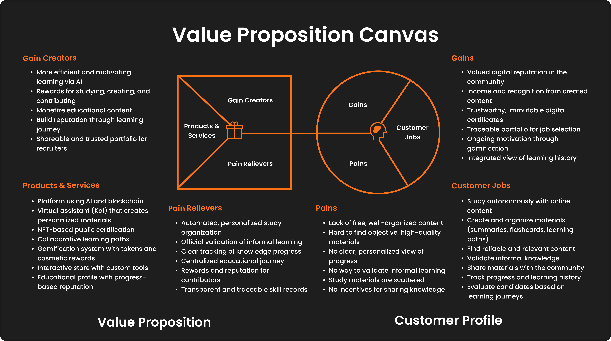
Fonte: Material produzido pelos autores (2025)

**Trabalhos do cliente:** 
- Estudar de forma autônoma utilizando conteúdos dispersos online.
- Buscar materiais confiáveis e atualizados para a área de tecnologia.
- Validar oficialmente o conhecimento adquirido em tutoriais e projetos práticos.
- Construir um portfólio atraente para recrutadores.

**Dores:** 
- Cursos tradicionais são caros, longos e rapidamente ficam desatualizados.
- Falta de validação para quem estuda por conta própria (síndrome do impostor).
- Sensação de solidão no estudo online.
- Criadores de conteúdo técnico têm dificuldade em monetizar seus materiais fora do YouTube.

**Ganhos:** 
- Criação de uma reputação digital validada por dados (histórico de quizzes e exercícios).
- Economia de tempo ao usar a IA para resumir e estruturar PDFs e documentações.
- Possibilidade de renda extra (para criadores que vendem trilhas premium).
- Motivação contínua através de gamificação, rankings e recompensas virtuais.

**Produtos e Serviços:** 
- Plataforma educacional web SaaS (Frontend React/Vite, Backend NestJS).
- Assistente IA (Kai) para geração de trilhas e flashcards.
- Certificação Digital Autenticada (com URL de validação pública).
- Feed da comunidade e sistema de "Fork" de trilhas de estudo.
- Sistema de gamificação, pontuação e loja de cosméticos para perfis.

**Analgésicos:** 
- Organização automatizada de estudos baseada nos próprios links do usuário.
- Validação rápida de conhecimento sem depender do MEC ou faculdades de 4 anos.
- Ferramenta "tudo-em-um" (substitui o Notion, Anki e ChatGPT soltos em abas diferentes).

**Criadores de Ganhos (Gain Creators):** 
- Experiência de estudo personalizada.
- Painel de análise (Dashboard) para recrutadores validarem as habilidades do candidato.
- Portfólio educacional compartilhável e dinâmico.

### 2.1.5 Tela do Modelo de Negócios

O Business Model Canvas (BMC) estrutura os principais elementos que sustentam o Kaisen. O modelo foi desenhado para ser escalável via infraestrutura em nuvem, focando em receita recorrente e monetização de marketplace.

Figura 4 - Business Model Canvas
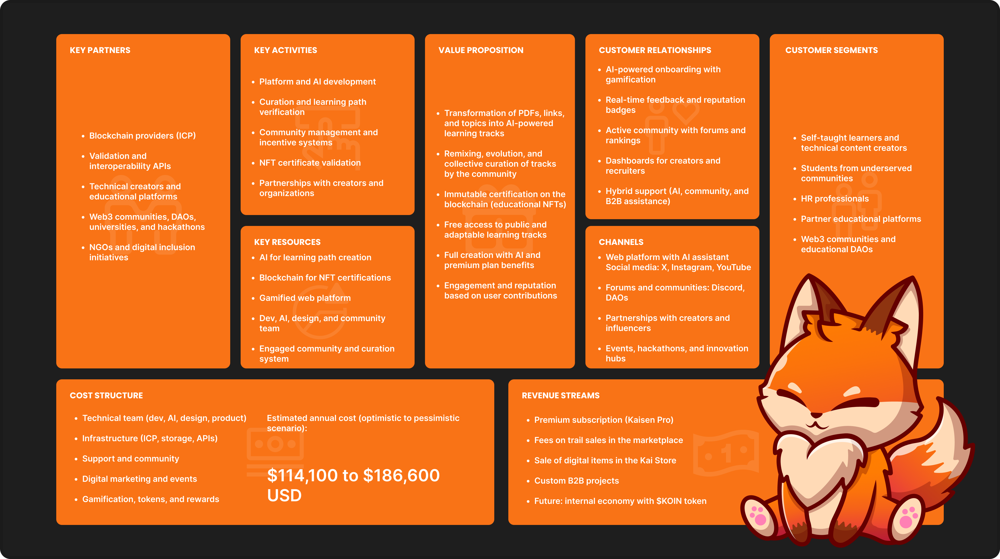
Fonte: Material produzido pelos autores (2025)

#### 1. Proposta de Valor
O Kaisen transforma conteúdo online não estruturado em trilhas de aprendizagem gamificadas, validadas e assistidas por IA. 
- **Para Estudantes:** Uma ferramenta que automatiza a criação de cronogramas de estudo e atesta o aprendizado através de certificados verificáveis.
- **Para Criadores:** Uma plataforma para monetizar trilhas de conhecimento técnico de forma justa (75% de comissão).
- **Para Empresas:** Uma fonte de dados confiável para recrutamento, baseada em histórico real de resolução de problemas e engajamento, não apenas em diplomas.

#### 2. Segmentos de Clientes
- **B2C (Estudantes e Autodidatas):** Jovens e adultos em transição de carreira, estudantes de tecnologia, e profissionais buscando upskilling contínuo.
- **B2C (Criadores):** Tech leads, influenciadores de tecnologia e professores independentes.
- **B2B (Empresas/RH - Expansão Futura):** Startups e corporações que precisam de ferramentas para treinamento interno (onboarding corporativo) ou validação de candidatos técnicos.

#### 3. Canais
- **Aquisição:** Marketing de conteúdo, SEO, tráfego pago (Instagram/LinkedIn Ads), influenciadores de tecnologia no YouTube e TikTok.
- **Entrega:** Aplicação Web Responsiva (SaaS).
- **Comunidade:** Discord oficial da plataforma, grupos no Telegram e perfis institucionais no LinkedIn e X.

#### 4. Relacionamento com o Cliente
- Self-service com onboarding gamificado (guiado pelo assistente IA Kai).
- Suporte comunitário ágil (via Discord).
- Engajamento contínuo através de notificações de ofensiva de estudo (streaks), e-mails de acompanhamento de progresso e rankings semanais.

#### 5. Fluxos de Receita
- **Kaisen Pro (SaaS B2C):** Assinatura mensal/anual (ex: R$ 44,90/mês) que libera uso ilimitado da IA para criação de trilhas e personalização avançada de certificados.
- **Marketplace (Revenue Share):** Retenção de 25% sobre a venda de trilhas exclusivas criadas por especialistas dentro da plataforma.
- **Kaisen for Business (B2B SaaS - Futuro):** Planos corporativos para empresas utilizarem a plataforma para treinar equipes internas.

#### 6. Recursos Principais
- **Tecnológicos:** Arquitetura em nuvem (AWS/GCP), Banco de Dados Relacional (PostgreSQL), APIs de LLMs (Google Gemini), Backend escalável (NestJS).
- **Humanos:** Equipe de engenharia de software, especialistas em produto (UX/UI), e gestão de tráfego/comunidade.
- **Propriedade Intelectual:** Algoritmo proprietário de estruturação de prompts e análise de retenção educacional.

#### 7. Atividades Principais
- Desenvolvimento e manutenção contínua da plataforma de software.
- Engenharia de Prompt e fine-tuning de modelos de IA para garantir a precisão dos materiais didáticos gerados.
- Marketing digital, otimização de funil de vendas (CRO) e gestão ativa da comunidade.

#### 8. Parcerias-Chave
- **Infraestrutura:** Provedores de nuvem (AWS Startups/Google Cloud) e provedores de IA.
- **Estratégicas:** Bootcamps de programação, universidades, criadores de conteúdo técnico (influenciadores), e plataformas de pagamentos (Stripe/Mercado Pago).

#### 9. Estrutura de Custos
O modelo opera com altos custos fixos de equipe e custos variáveis atrelados ao uso da plataforma (nuvem e IA).
- **Equipe (Maior custo fixo):** Desenvolvedores (Frontend React, Backend NestJS), Designer UX/UI, Marketing/Comunidade.
- **Infraestrutura Cloud e APIs (Custo variável):** Servidores na AWS/GCP, instâncias de banco de dados PostgreSQL, chamadas de API do Google Gemini.
- **Marketing e Vendas:** CAC (Custo de Aquisição de Clientes) via tráfego pago e campanhas.
- **Operacional e Ferramentas:** Softwares de gestão, gateways de pagamento (taxas por transação), contabilidade e jurídico.

## 2.2. Personas

Representando indivíduos específicos, as personas são perfis semifictícios construídos com base em dados reais e observações sobre o público-alvo. Sua principal função é facilitar o entendimento das necessidades, comportamentos e motivações dos usuários, permitindo o desenvolvimento de soluções mais direcionadas e eficazes.

Abaixo estão três personas desenvolvidas especificamente para este projeto para orientar a tomada de decisões e garantir maior alinhamento com as expectativas do usuário final.

Figura 5 - Persona 1

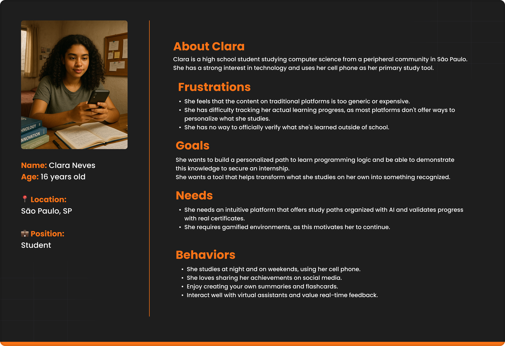

Fonte: Material produzido pelos autores (2025)

Ela representa uma jovem estudante ambiciosa de uma comunidade periférica que vê a tecnologia como um caminho para novas oportunidades. Aluna do ensino médio técnico cursando Ciência da Computação na periferia de São Paulo, ela personifica o aprendiz autodidata, utilizando a tecnologia móvel como aliada em sua jornada educacional. A personalidade de Clara destaca a importância da aprendizagem acessível e personalizada, capaz de transformar o estudo informal em credenciais reconhecidas – um desafio fundamental para estudantes que procuram demonstrar as suas competências para além dos ambientes académicos tradicionais.

Figura 6 - Persona 2

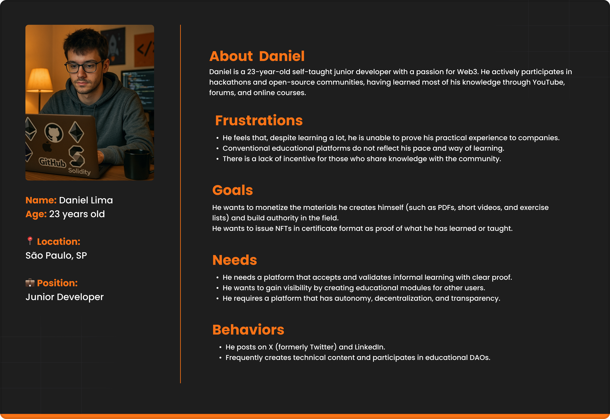

Fonte: Material produzido pelos autores (2025)

Ele personifica o desenvolvedor autodidata moderno que se destaca no ecossistema Web3. Aos 23 anos, esse desenvolvedor júnior representa uma comunidade crescente de profissionais que aprimoraram suas habilidades por meio de caminhos de aprendizagem alternativos, como tutoriais no YouTube, contribuições para projetos de código aberto e participação em hackathons. Sua persona destaca a lacuna entre o conhecimento prático e o reconhecimento formal, ao mesmo tempo que simboliza a economia criativa, na qual os produtores de conteúdo educacional buscam gerar impacto e monetizar seu conhecimento.

Figura 7 - Persona 3

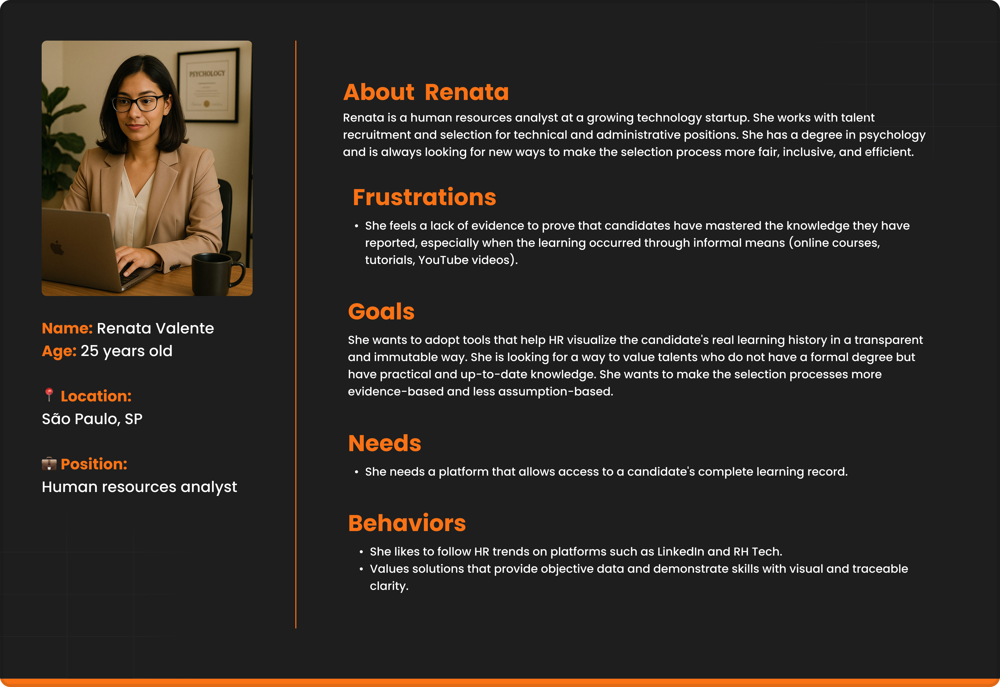

Fonte: Material produzido pelos autores (2025)

Ela representa o profissional de RH progressista que trabalha em um cenário de talentos em constante mudança, especialmente em startups de tecnologia. Como analista de RH com formação em Psicologia, ela enfrenta o desafio diário de avaliar candidatos cujas competências mais relevantes foram muitas vezes adquiridas através de percursos de aprendizagem não tradicionais. A sua personalidade destaca o dilema do recrutador moderno: como reconhecer e validar de forma justa a aprendizagem informal e, ao mesmo tempo, desenvolver processos de seleção mais inclusivos e baseados em evidências, capazes de identificar talentos para além das credenciais educacionais formais.

# 3. Projeto de aplicação

## 3.1. Diagrama de Arquitetura

O diagrama de arquitetura da aplicação, conforme ilustrado na imagem, foi projetado com uma separação clara entre as camadas front-end, autenticação, back-end e integração externa. Essa estrutura modular visa garantir não apenas a organização e facilidade de manutenção do código, mas também segurança, escalabilidade e uma experiência de usuário de alto desempenho. O diagrama é, portanto, uma ferramenta essencial para visualizar a organização dos componentes, facilitando o entendimento entre os desenvolvedores e orientando as decisões técnicas ao longo do projeto.

Figura 8 - Diagrama de arquitetura

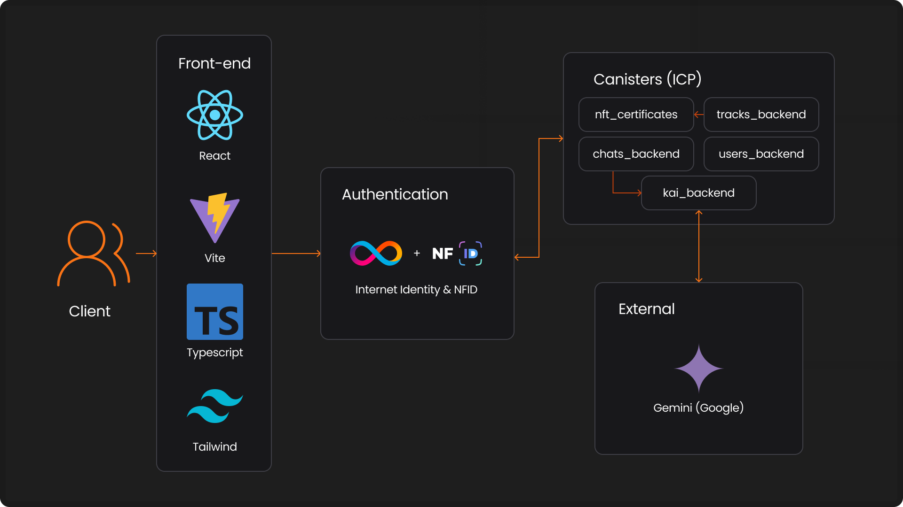

Fonte: Material produzido pelos autores (2025)

O front-end representa a camada de interação direta com o cliente, construída com um conjunto de tecnologias modernas para garantir uma interface eficiente. A base da interface é desenvolvida em React, que permite a criação de componentes de UI dinâmicos e reutilizáveis. O processo de desenvolvimento é acelerado pelo Vite, uma ferramenta de construção de alta velocidade. Para garantir a robustez e qualidade do código, o projeto adota TypeScript, que adiciona tipagem estática ao JavaScript, enquanto a estilização é gerenciada pelo Tailwind CSS, um framework utilitário que permite a construção de designs customizados de forma ágil e consistente.

A ponte entre a interface do usuário e os serviços back-end é a camada de autenticação, que adota padrões modernos de mercado para garantir a segurança dos dados. Utilizando protocolos consolidados como JWT (JSON Web Tokens) e OAuth, o sistema permite que os usuários acessem a aplicação de forma protegida e rápida. Isso fortalece a segurança, a privacidade e a experiência do usuário, oferecendo fluxos de login simplificados e gerenciamento seguro de sessões.

O núcleo lógico do aplicativo reside no back-end, que é implementado utilizando **NestJS**, um framework Node.js progressivo, operando em conjunto com um banco de dados relacional **PostgreSQL** por meio do ORM **Prisma**. Essa escolha garante uma arquitetura escalável, transações seguras e alta integridade relacional dos dados. Dentro dessa estrutura, diversos módulos operam de forma orquestrada para entregar as funcionalidades da plataforma: o módulo de usuários gerencia perfis e históricos; o módulo de trilhas serve como repositório central para as jornadas de aprendizagem; o módulo de interações permite a comunicação da comunidade; e o módulo de certificação é responsável por gerar e emitir Certificados Digitais Autenticados de conclusão, garantindo sua validade e rastreabilidade por meio de códigos de verificação únicos no banco de dados.

Para aprimorar a aplicação com inteligência artificial avançada, a arquitetura integra um serviço externo de última geração. A orquestração dessa integração é feita pelo módulo do assistente Kai, que atua como intermediário seguro no back-end. Ele recebe as matérias-primas fornecidas pelo usuário (como PDFs e links) e aciona o modelo de linguagem Gemini, do Google, por meio de chamadas de API REST. O Gemini então processa esses dados para gerar trilhas de aprendizagem personalizadas. Esta abordagem combina o poder de processamento de um LLM de grande escala na nuvem com a estabilidade e eficiência de regras de negócio centralizadas.
 
Este diagrama é essencial para visualizar a organização dos componentes, facilitando o entendimento entre desenvolvedores e stakeholders e orientando as decisões técnicas ao longo do desenvolvimento.

## 3.2. Guia de Estilo

O guia de estilo do Kaisen tem como objetivo garantir a consistência visual e funcional em toda a interface da plataforma. Ele serve como referência central para designers e desenvolvedores, padronizando o uso de cores, tipografia e elementos gráficos. Ao fortalecer a identidade visual do Kaisen, o guia reduz inconsistências no desenvolvimento da interface e assegura acessibilidade, coerência estética e escalabilidade entre os diferentes módulos da aplicação — sejam eles voltados para o aprendizado individual, validação comunitária ou apresentação pública do conhecimento adquirido.

### 3.2.1. Cores

A paleta de cores é um elemento essencial na construção visual, contribuindo para a comunicação clara do propósito da aplicação e reforçando seus valores de autonomia, inovação e descentralização. As cores foram escolhidas com base em princípios de contraste, acessibilidade e hierarquia visual, garantindo uma experiência intuitiva, funcional e acolhedora para diferentes perfis de usuários.

Figura 9 - Cores

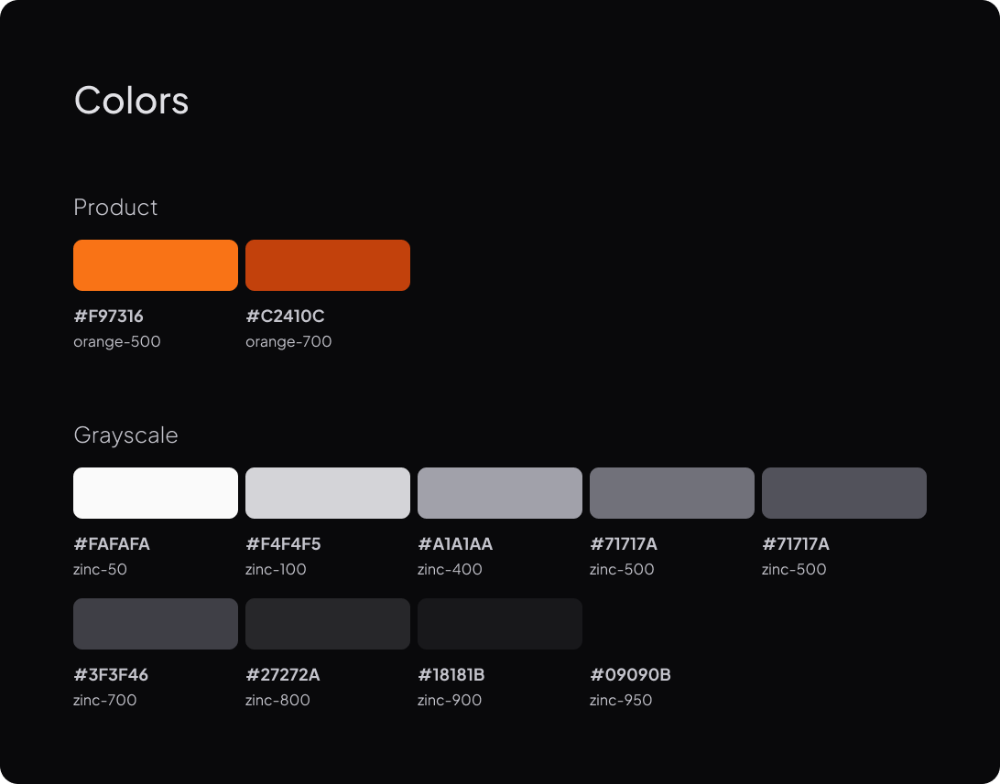

Fonte: Material produzido pelos autores (2025)

A cor principal da identidade visual é um tom vibrante de laranja (#F97316 | orange-500), que evoca energia, criatividade e transformação — aspectos centrais da proposta educacional do Kaisen. Essa cor é aplicada a elementos interativos de destaque, como botões primários, chamadas para ação e marcadores de progresso. Sua variação mais intensa, o laranja escuro (#C2410C | orange-700), é utilizada em contextos que exigem maior ênfase ou profundidade visual, mantendo a consistência e o dinamismo na comunicação.

A paleta também inclui uma escala de cinzas cuidadosamente distribuída, que vai do branco (#FAFAFA | zinc-50) ao preto (#09090B | zinc-950). Esses tons neutros proporcionam equilíbrio à interface, permitindo que os elementos em laranja se destaquem claramente, além de garantir legibilidade e acessibilidade em diferentes dispositivos e modos de visualização (como o modo escuro).

Cada cor da paleta cumpre um papel estratégico — seja como fundo, contorno, sombra ou texto — reforçando a identidade do Kaisen e promovendo uma navegação consistente e fluida, focada no aprendizado contínuo.

### 3.2.2. Tipografia

A tipografia utilizada na plataforma Kaisen foi selecionada para proporcionar uma leitura fluida e acessível em diferentes dispositivos e contextos. A fonte Poppins, disponível no Google Fonts, foi escolhida por seu design limpo e moderno.

Figura 10 - Tipografia

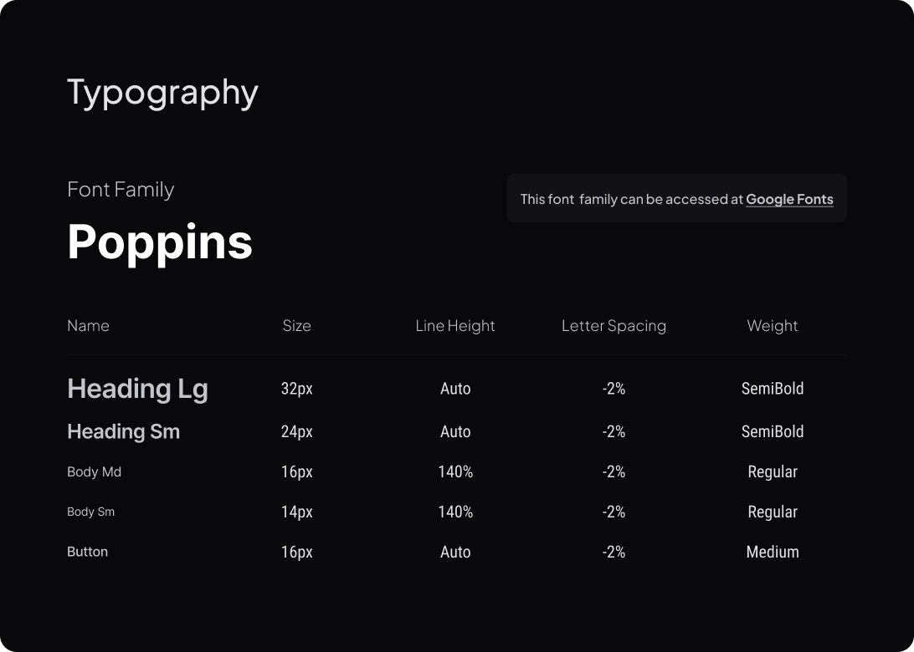

Fonte: Material produzido pelos autores (2025)

O uso de uma única família tipográfica em toda a interface contribui para a uniformidade do design, enquanto as variações de tamanho, peso e espaçamento permitem a criação de uma hierarquia visual bem definida. Títulos e chamadas para ação utilizam pesos mais ousados, como SemiBold, em tamanhos maiores (32px e 24px), para destacar informações relevantes e orientar a navegação do usuário. Textos corridos, como descrições e instruções, utilizam pesos Regular ou Medium, com tamanhos entre 14px e 16px e espaçamento consistente de -2%, promovendo uma leitura confortável e fluida.

### 3.2.3. Elementos Visuais

Os elementos visuais da plataforma Kaisen foram concebidos para comunicar, de forma simbólica e emocional, os valores centrais da solução. Destacam-se entre esses elementos o mascote e o logotipo, que reforçam a identidade da plataforma e promovem uma conexão mais próxima com os usuários.

Figura 11 - Mascote

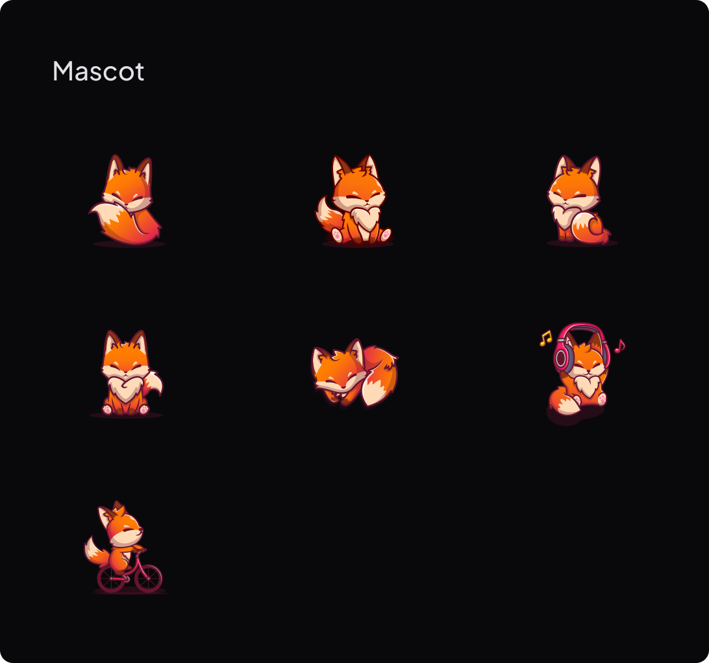

Fonte: Material produzido pelos autores (2025)

O mascote da plataforma, Kai, é uma raposa expressiva e acolhedora, apresentada em diversas variações que representam diferentes estados emocionais e momentos da jornada de aprendizagem — como estudando, relaxando, ouvindo música ou em movimento. A escolha desse animal evoca atributos como inteligência, curiosidade e leveza, refletindo a visão da plataforma de tornar o aprendizado mais humano e acessível. A presença do mascote contribui para fortalecer a conexão emocional com os usuários, tornando a experiência mais cativante e engajadora.

Figura 12 - Logotipo

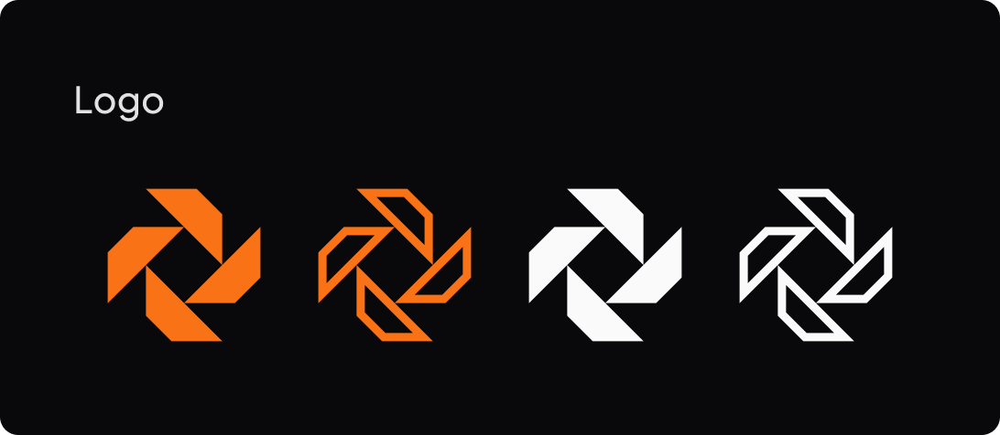

Fonte: Material produzido pelos autores (2025)

O logotipo do Kaisen, por sua vez, é composto por formas geométricas modulares organizadas em torno de um bloco central — símbolo-chave da identidade visual da plataforma. Esse bloco central carrega o significado: representa os blocos de conhecimento construídos ao longo do processo de aprendizagem. Não se trata de uma forma sólida tradicional, como um quadrado ou retângulo; ao contrário, é formado por várias partes que se conectam e evoluem.

Essa composição fragmentada simboliza a natureza colaborativa e em constante evolução do Kaisen, onde usuários e inteligência artificial trabalham juntos para organizar, validar e expandir o conhecimento. O logotipo, assim, transmite os pilares fundamentais da proposta da plataforma: autonomia, tecnologia e coautoria.

Juntos, o mascote Kai e o logotipo formam uma identidade visual forte e simbólica, alinhada aos princípios do Kaisen — uma plataforma que combina tecnologia de ponta com empatia e propósito, transformando a maneira como as pessoas aprendem e compartilham conhecimento.

## 3.3. Protótipo de alta fidelidade

Um protótipo de alta fidelidade fornece uma representação visual detalhada do aplicativo. Simula o formato dos campos do design, as interações e a experiência do usuário, utilizando cores, tipografia, ícones, botões e outros elementos gráficos compatíveis com o produto final.

Este tipo de protótipo permite validar decisões de design antes do início do desenvolvimento, testar a usabilidade com usuários reais e apresentar a solução visual e funcionalmente aos interessados.

O protótipo completo pode ser acessado através da plataforma Figma, pelo seguinte link: [Figma Prototype](https://www.figma.com/design/qPsCtf4GvgwH6cmUgdy7Q8/Kaisen--WCHL-?node-id=11-55&p=f&t=iUgnCTERVnBrP4BJ-0)

Abaixo estão as telas prototipadas, que ilustram as principais funcionalidades do aplicativo:

Figura 13 - Home
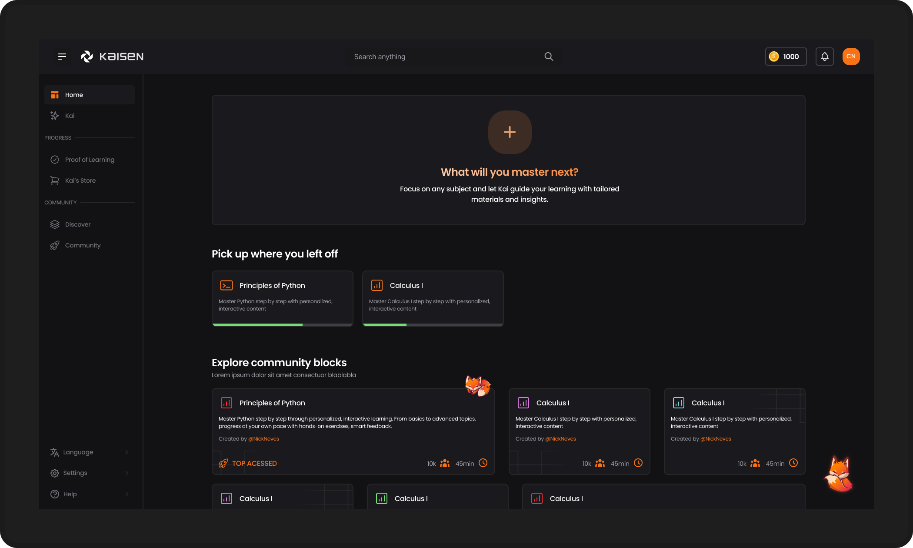
Fonte: Material produzido pelos autores (2025)

A tela inicial serve como ponto central de navegação da plataforma, oferecendo aos usuários uma visão panorâmica de seu progresso e acesso rápido aos principais recursos. Sendo o primeiro contato do usuário com a aplicação, desempenha um papel crucial na definição da experiência, ditando o tom visual e funcional da jornada. Ela exibe trilhas de aprendizagem em destaque e estatísticas personalizadas, facilitando a descoberta intuitiva de conteúdos relevantes.

Figura 14 - Suporte e Ajuda (Kai)
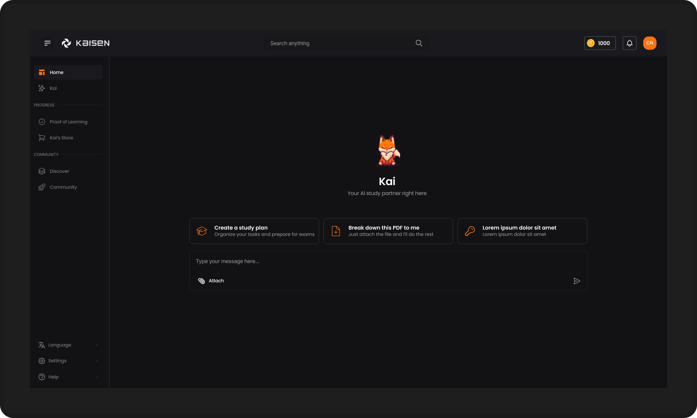
Fonte: Material produzido pelos autores (2025)

Essa interface permite a comunicação com o assistente virtual da plataforma, Kai. Por meio desse canal interativo, os usuários podem tirar dúvidas sobre a navegação, buscar materiais específicos no banco de dados da plataforma e receber orientações sobre como estruturar melhor seus estudos. Esta funcionalidade centraliza o suporte ao aluno de forma dinâmica e amigável.

Figura 15 - Trilhas
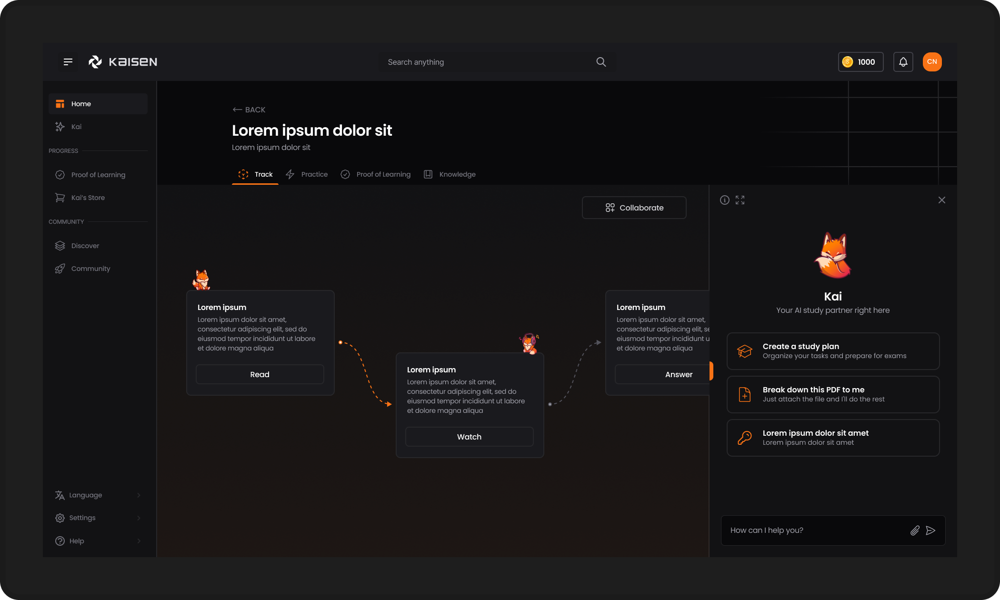
Fonte: Material produzido pelos autores (2025)

A tela de trilhas é o ambiente central de descoberta de conteúdo, onde todo o material da plataforma é organizado e categorizado por áreas de conhecimento. Para facilitar a busca, a interface oferece recursos de filtragem por temas, interesses e níveis de dificuldade, permitindo ao usuário encontrar facilmente as jornadas mais adequadas aos seus objetivos educacionais. Além disso, a plataforma incentiva a construção coletiva: os usuários que desejam sugerir melhorias em uma trilha pública podem iniciar sua colaboração através do botão “Colaborar”.

Figura 16 - Visão Geral da Trilha
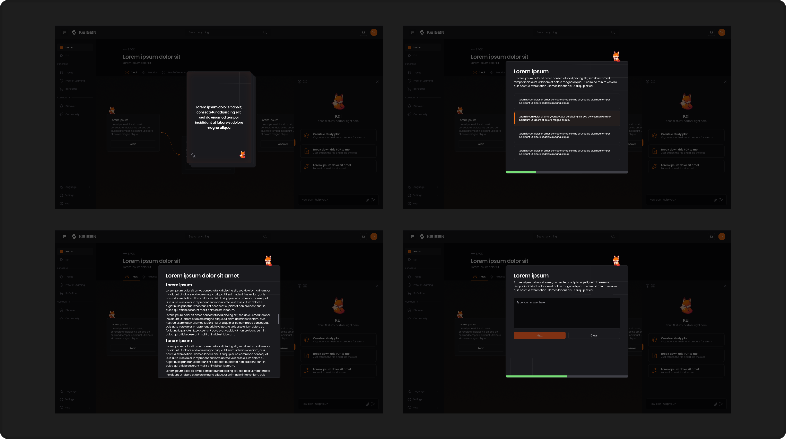
Fonte: Material produzido pelos autores (2025)

Os modais fornecem uma visão geral detalhada de uma trilha de aprendizagem específica, incluindo sua descrição, progresso do usuário, módulos disponíveis, conteúdo relacionado e recursos suplementares. São componentes essenciais para o engajamento, pois permitem acesso direto a diversos tipos de recursos educacionais, como flashcards, resumos, quizzes e vídeos. Assim, proporcionam uma experiência de aprendizagem mais dinâmica, interativa e estruturada.

Figura 17 - Prática e Comprovação de Aprendizagem
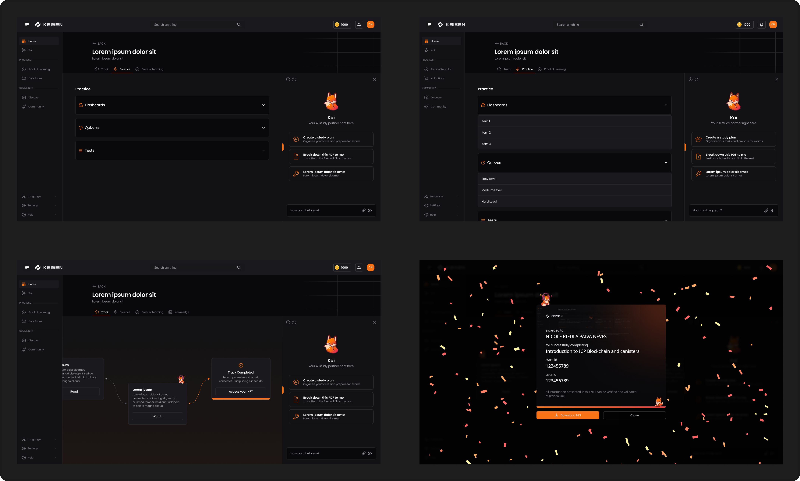
Fonte: Material produzido pelos autores (2025)

Na seção Prática, os usuários têm acesso a recursos que os auxiliam na revisão do conteúdo estudado ao longo da trilha, incluindo quizzes e testes interativos. Esses recursos são essenciais para consolidar o aprendizado e validar o progresso individual. Ao concluir as atividades propostas com êxito, o usuário desbloqueia a seção de Comprovação de Aprendizagem, onde obtém seu Certificado Digital Autenticado. Este certificado possui um código de verificação único no banco de dados da plataforma, garantindo sua validade para o mercado de trabalho. A interface também oferece opções de compartilhamento direto no LinkedIn e outras redes, aumentando a visibilidade das conquistas do usuário.

Figura 18 - Descubra
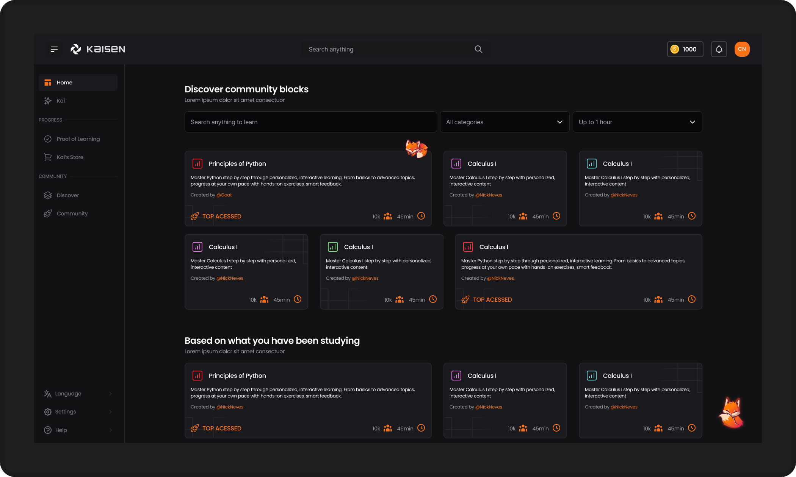
Fonte: Material produzido pelos autores (2025)

O recurso Descobrir tem como objetivo ampliar as possibilidades de aprendizagem, facilitando a exploração de novas trilhas e conteúdos por meio de categorias temáticas, filtros inteligentes e recomendações. Essa tela é vital para manter o envolvimento contínuo dos usuários e estimular a curiosidade, conectando-os a conhecimentos que de outra forma poderiam passar despercebidos.

Figura 19 - Perfil
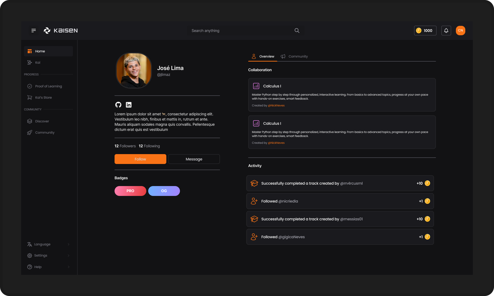
Fonte: Material produzido pelos autores (2025)

A tela de perfil é um painel centralizado que consolida todas as informações, histórico de estudos e contribuições do usuário na plataforma Kaisen, oferecendo uma visão abrangente de sua jornada educacional. Apresenta informações de identificação, biografia pessoal, links para redes sociais e métricas de conexão (seguidores/seguindo). A interface também inclui uma seção de emblemas (badges) que destaca conquistas gamificadas.

O conteúdo principal é organizado em abas: a aba “Visão Geral” exibe as trilhas que o usuário criou e um feed de atividades recentes; já a aba “Comunidade” permite acessar publicações e acompanhar o engajamento social.

Figura 20 - Loja de Recompensas
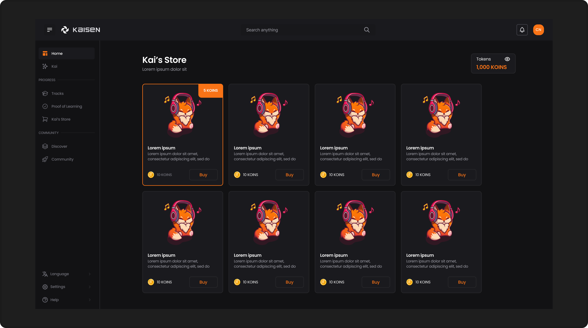
Fonte: Material produzido pelos autores (2025)

A loja é uma interface gamificada onde os usuários podem usar os pontos de experiência (XP) ou moedas virtuais da plataforma — adquiridas ao completar trilhas e manter ofensivas de estudo — para resgatar personalizações visuais, avatares, bordas de perfil e recursos cosméticos exclusivos. Este é um recurso estratégico para retenção de usuários, oferecendo incentivos tangíveis para o engajamento contínuo e fortalecendo o vínculo com a plataforma.

Figura 21 - Configurações e Comunidade
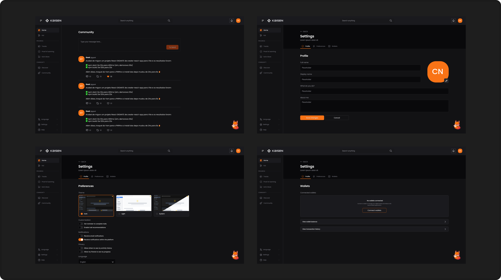
Fonte: Material produzido pelos autores (2025)

A tela de configurações permite que os usuários ajustem suas preferências, gerenciem assinaturas, configurem notificações e editem os dados da conta de forma segura. 

A tela da comunidade serve como um fórum integrado para fortalecer as interações. Aqui, os participantes podem compartilhar reflexões sobre o processo de aprendizagem, tirar dúvidas técnicas, divulgar trilhas que criaram e interagir com o conteúdo de outros membros. Essa dinâmica constrói uma rede de apoio mútuo e desenvolvimento coletivo.

Figura 22 - Criar Trilhas
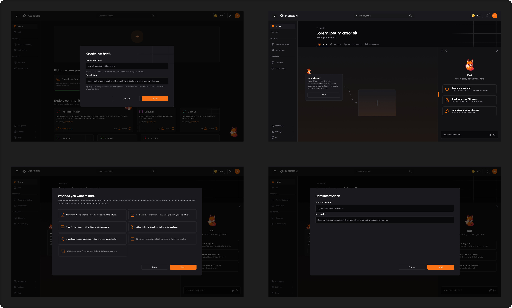
Fonte: Material produzido pelos autores (2025)

O processo de criação de uma nova trilha de aprendizagem é um fluxo de trabalho flexível para produtores de conteúdo. O fluxo começa com a definição de informações básicas (título, descrição e público-alvo). Em seguida, o autor acessa um construtor visual interativo, onde pode estruturar a trilha de forma dinâmica, adicionando e conectando diferentes módulos (resumos, flashcards, vídeos e avaliações) para desenhar a jornada pedagógica ideal.

Figura 23 - Criar Seções
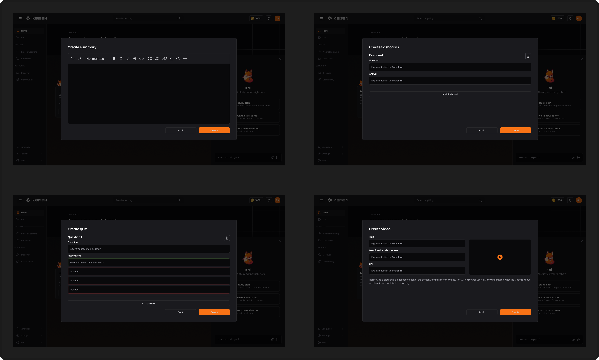
Fonte: Material produzido pelos autores (2025)

Dentro do construtor de trilhas, a plataforma oferece ferramentas específicas para a criação de diversos formatos de conteúdo:
- **Resumos:** O usuário utiliza um editor de *rich text* completo para formatar textos (negrito, listas, links), garantindo um material de leitura bem estruturado.
- **Flashcards:** Ideal para memorização. O autor define a "Frente" (pergunta/termo) e o "Verso" (resposta/definição) de múltiplos cartões.
- **Quizzes:** Permite elaborar perguntas objetivas de múltipla escolha, sinalizando a alternativa correta para garantir a correção automatizada pela plataforma.
- **Vídeos:** O autor pode incorporar links de plataformas de vídeo, adicionando título e contexto. O sistema exibe um *preview* automático para garantir que a mídia foi carregada corretamente.

Figura 24 - Ferramentas de Colaboração
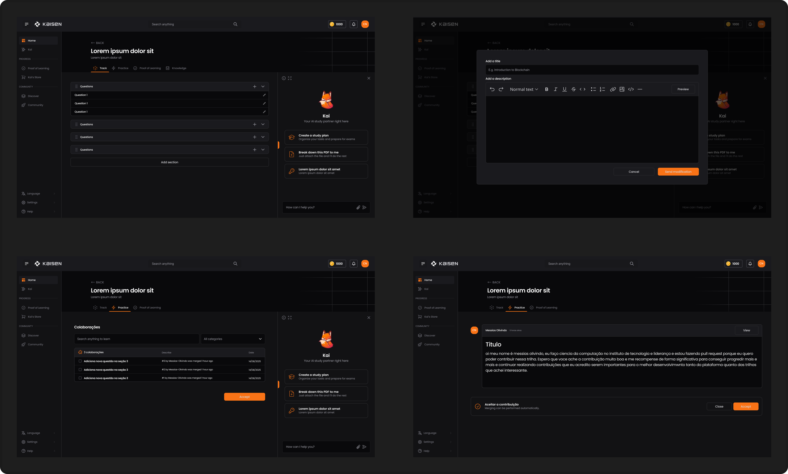
Fonte: Material produzido pelos autores (2025)

Inspirada no modelo open-source, a tela de colaboração permite que outros usuários sugiram melhorias em uma trilha pública (sistema semelhante a um *Pull Request*). Colaboradores podem sugerir a reorganização de módulos, correção de textos ou adição de novos quizzes e flashcards.

Após o envio da sugestão, o autor original da trilha recebe uma notificação. Em seu painel de gerenciamento, ele visualiza um histórico detalhado contendo o que foi modificado, quem sugeriu e quando. O autor tem o poder total de revisar as alterações, podendo "Aceitar" (integrando o conteúdo à trilha oficial) ou "Rejeitar" a colaboração. Este sistema garante a integridade do material original enquanto escala a qualidade do conteúdo através do conhecimento da comunidade.

# 4. Desenvolvimento de aplicativos

## 4.1. Primeira versão do aplicativo

Foi concluída a primeira versão do MVP da aplicação Kaisen, fornecendo a estrutura essencial do sistema, com foco na validação dos principais fluxos de utilização e integrações entre backend e frontend. Essa entrega inicial priorizou a experiência do usuário, autenticação, recursos básicos de interação e integração com a camada blockchain.

#### Estrutura e recursos implementados

Nesta versão inicial foram entregues os seguintes componentes funcionais:

- **Página inicial com menu de navegação:** Interface clara, com acesso rápido às principais áreas do sistema.
- **Gerenciamento de perfil de usuário:** Criação, visualização e edição de perfis, incluindo apelidos, biografias e funções.
- **Painel da comunidade:** Tela para visualização de postagens da comunidade, promovendo interação e engajamento entre os usuários.
- **Gerenciamento e exibição de trilhas de usuários:** Veja trilhas criadas, em andamento e concluídas para cada perfil.

#### Processo de Desenvolvimento Técnico

O desenvolvimento combinou tecnologias modernas, com uma divisão clara entre o frontend React/Vite (TypeScript) e o backend Motoko. Hooks e provedores foram criados para autenticação, gerenciamento de usuários e integração de operações com canisters Motoko. O sistema de chat AI usa solicitações assíncronas, histórico contextual e persistência de interação.

#### Ilustrações de tela
Algumas das principais telas implementadas nesta versão são:

Figura 25 - Home

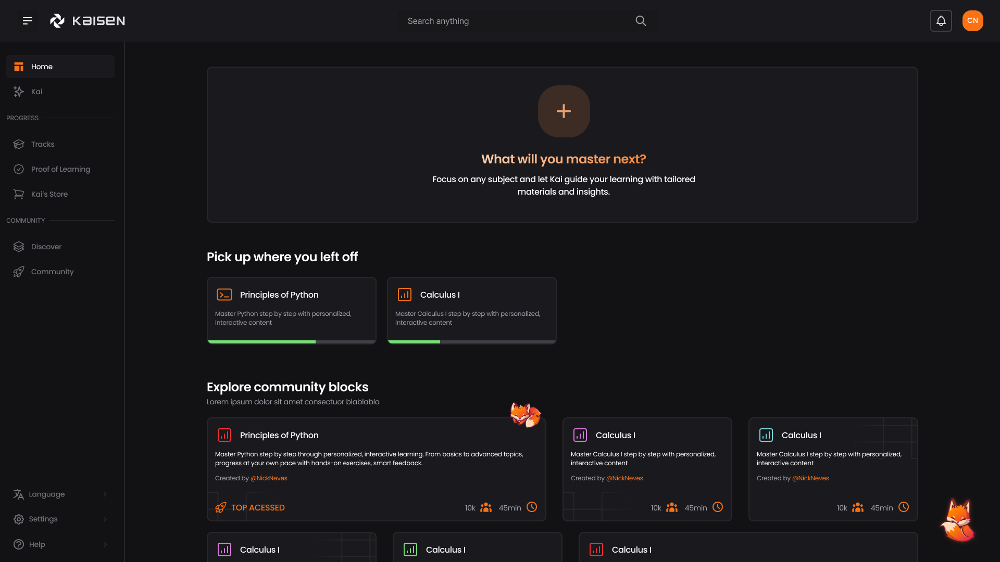

Fonte: Material produzido pelos autores (2025)

Figura 26 - Trilhas

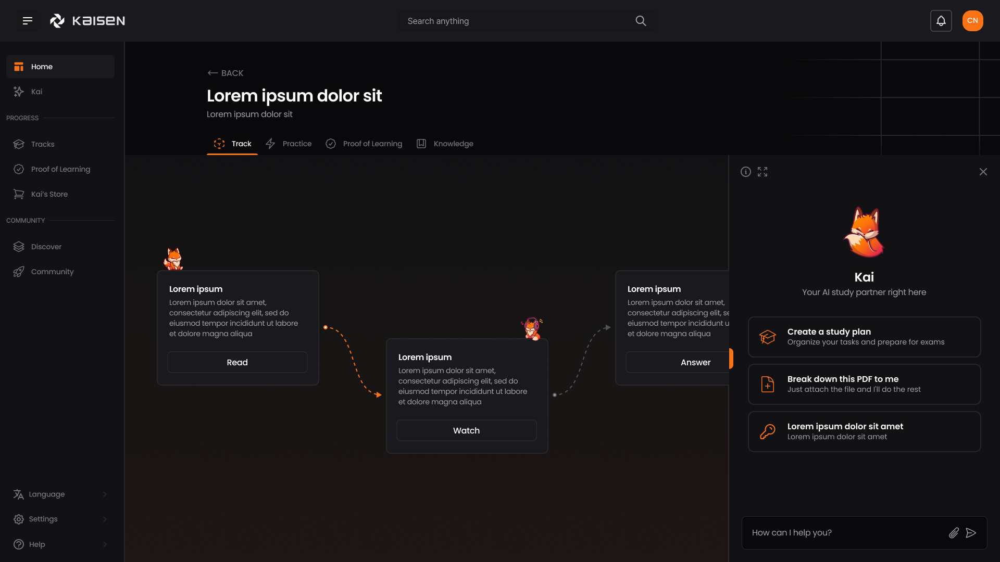

Fonte: Material produzido pelos autores (2025)

Figura 27 - Descobrir

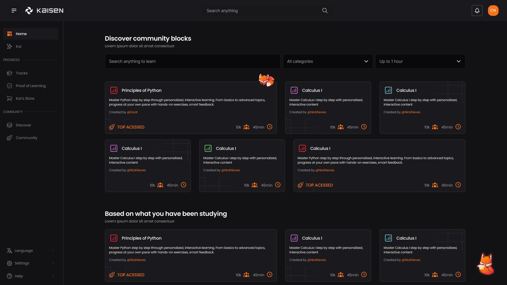

Fonte: Material produzido pelos autores (2025)

#### Desafios enfrentados

Entre os principais desafios estavam a integração segura entre o frontend e os canisters Motoko, a modelagem do fluxo de autenticação descentralizada e a gestão do status da conversa com IA, garantindo atualizações em tempo real da interface e consistência dos dados do usuário.

Esta versão MVP valida os pilares essenciais da plataforma Kaisen, servindo como uma base sólida para a evolução contínua e a inclusão de novas funcionalidades nas próximas etapas do projeto.

## 4.2 Segunda versão do aplicativo

A segunda versão da plataforma Kaizen representa uma evolução significativa, focada em melhorar a experiência do usuário e expandir as principais funcionalidades do ecossistema de aprendizagem. O principal objetivo era solidificar a infraestrutura técnica com o desenvolvimento de um back-end robusto e, ao mesmo tempo, introduzir novos recursos para aumentar o engajamento, a interatividade e a validação das conquistas dos usuários por meio de tecnologias inovadoras como os NFTs.

Para garantir uma implementação coesa e alinhada aos objetivos de usabilidade, todo o desenvolvimento seguiu um protótipo de alta fidelidade. Isso permitiu a programação de novas telas e a reestruturação precisa das interfaces existentes, resultando em um produto final mais polido, intuitivo e funcional, preparado para suportar novas interações da comunidade e solidificar o modelo de aprendizagem da plataforma.

#### Estrutura e recursos implementados
Nesta nova versão foram entregues os seguintes componentes funcionais, transformando a plataforma em um ecossistema de aprendizagem mais completo e colaborativo:

- **Gerenciamento de certificados NFT:** Implementação do fluxo completo de geração, visualização e gerenciamento de certificados NFT, validando as conquistas dos usuários no blockchain.
- **Sistema de Autenticação de Usuário:** Implementação de login, logout e gerenciamento de identidade, integrando com o backend da Motoko.
- **AI Chat (Kai):** Funcionalidade de chat inteligente, permitindo aos usuários iniciar conversas com IA, salvar histórico e respostas dinâmicas.
- **Fluxo de criação de trilhas:** Ferramentas avançadas para os usuários criarem trilhas de aprendizagem complexas, com suporte para vários tipos de conteúdo, como resumos, questionários, flashcards e vídeos.
- **Sistema de Colaboração da Comunidade:** Uma nova área que permite aos usuários sugerir edições e melhorias em faixas existentes, com sistema de aprovação do autor original.
- **Perfil de usuário aprimorado:** Reestruturação da tela de perfil para incluir métricas de engajamento, faixas publicadas, certificados e atividades recentes.
- **Verificação externa de NFT:** Uma página pública que permite a qualquer pessoa verificar a autenticidade de um certificado NFT por meio de um código exclusivo.

#### Processo de Desenvolvimento Técnico

O desenvolvimento foi orientado por um protótipo de alta fidelidade, garantindo coesão entre design e implementação. No back-end, foram criados serviços robustos para geração e gerenciamento de NFTs, além da implementação de endpoints para suporte à criação de trilhas (operações CRUD), do sistema “Koins”, do chat dinâmico e do acompanhamento do progresso do usuário. No front-end, a equipe implementou as novas interfaces, como o perfil aprimorado, o fluxo completo de criação de conteúdo e os modais de colaboração, além de ajustar o gerenciamento de identidades com suporte ao “DevAuth”.

#### Ilustrações de tela
Algumas das principais telas e fluxos implementados nesta versão são:

Figura 28 - Seção de adição de trilha

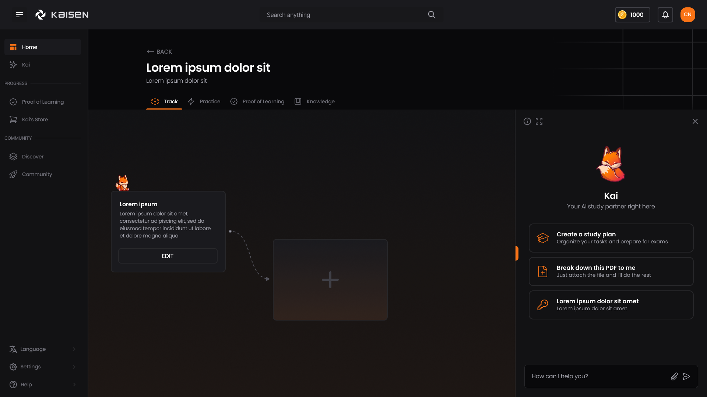

Fonte: Material produzido pelos autores (2025)

Figura 29 - NFT premiado

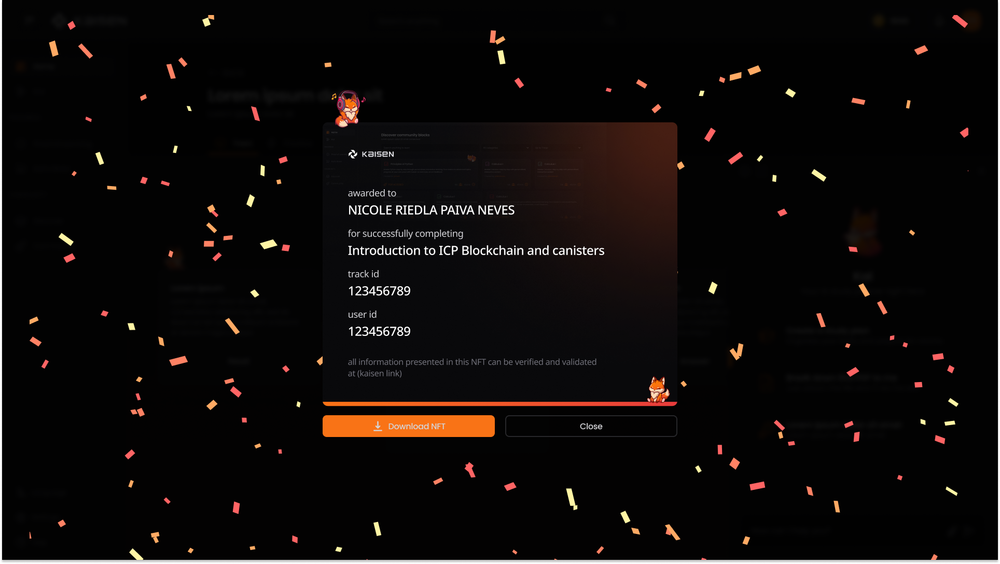

Fonte: Material produzido pelos autores (2025)

Figura 30 - Bate-papo

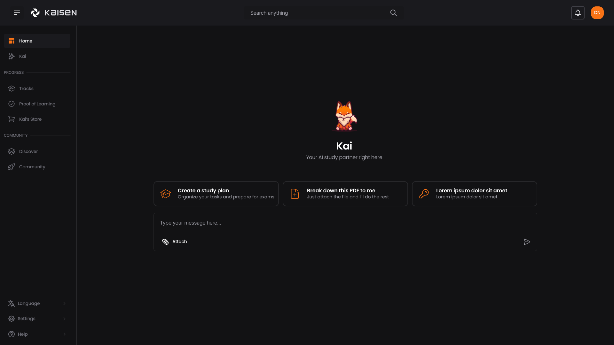

Fonte: Material produzido pelos autores (2025)

Figura 31 - Visão geral do perfil

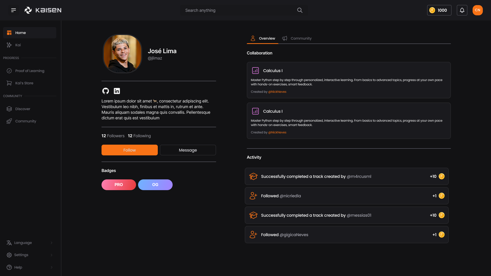

Fonte: Material produzido pelos autores (2025)

#### Desafios enfrentados

Entre os principais desafios estavam a integração do back-end com a tecnologia blockchain para geração e verificação de NFTs, a implementação de um sistema de colaboração que gerenciasse diferentes versões e aprovações de conteúdo e o desenvolvimento do back-end de chat para suportar interações dinâmicas e em tempo real. No front-end, o desafio era traduzir os fluxos complexos do protótipo em componentes interativos e responsivos.

Esta segunda versão do Kaisen solidifica a plataforma como um ecossistema de aprendizagem robusto e interativo. Os novos recursos para criação, colaboração e certificação via NFT não apenas enriquecem a experiência do usuário, mas também estabelecem uma base técnica avançada para a implementação futura de gamificação, personalização e outros recursos inovadores.

# 5. Estudo de Mercado e Plano de Marketing

A pesquisa de mercado e o plano de marketing da Kaisen buscam alinhar a proposta da plataforma às necessidades reais do público no contexto da educação digital. Compreender o comportamento de aprendizagem, os concorrentes e as tendências do setor permite posicionar a solução de forma mais precisa, enquanto o plano de marketing orienta sua comunicação, distribuição e promoção, com foco em aquisição, retenção e consolidação da marca.

## 5.1. Sumário executivo

Kaisen é uma plataforma educacional que integra inteligência artificial, aprendizagem colaborativa e certificação digital para transformar estudo informal em trajetórias estruturadas, compartilháveis e reconhecíveis. Em um contexto marcado pelo crescimento da aprendizagem autodirigida e pela fragmentação de conteúdos em diferentes ferramentas, a plataforma conecta organização, produtividade, reconhecimento e comunidade em uma experiência acessível e gamificada.

Seus principais diferenciais são a geração de trilhas personalizadas com base no conteúdo do próprio usuário, a possibilidade de colaboração e aprofundamento pela comunidade, a emissão de certificados digitais verificáveis e a monetização de trilhas criadas por especialistas e criadores. Com isso, a Kaisen propõe um modelo no qual aprender, organizar conhecimento e ensinar passam a gerar valor para quem consome e para quem cria.

Seus objetivos estratégicos incluem: (i) personalizar a aprendizagem com base no conteúdo do usuário; (ii) tornar o conhecimento produzido e adquirido mais organizável e validável; (iii) estimular a curadoria colaborativa e a criação de trilhas de alta qualidade; e (iv) transformar a aprendizagem em uma jornada gratificante, recorrente e economicamente sustentável.

## 5.2. Análise de Mercado

### 5.2.1. Visão geral da indústria

O mercado global de EdTech está em crescimento acelerado, impulsionado pela digitalização do ensino, pela popularização de ferramentas baseadas em IA e pela demanda crescente por aprendizagem autônoma. No Brasil, a educação online deixou de ser complementar e passou a ocupar um papel central na forma como estudantes e profissionais atualizam habilidades, especialmente em segmentos ligados à tecnologia, design e formação continuada.

Nesse cenário, há espaço para soluções que não se limitem à entrega de conteúdo pronto, mas que ajudem o usuário a transformar materiais dispersos em percursos de estudo estruturados. A integração de IA com mecanismos de organização, curadoria e certificação digital representa uma oportunidade relevante, especialmente em nichos com alta demanda por prova de competência prática e atualização constante.

### 5.2.2. Tamanho e crescimento do mercado

O mercado brasileiro de educação online gerou receita de R$ 1,8 bilhão em 2023, com expectativa de crescimento médio anual de 16% até 2027, segundo a ABED. Espera-se que plataformas que combinem autonomia, gamificação e validação de conhecimento ganhem força em meio à insatisfação com modelos rígidos e à busca por formas mais acessíveis e significativas de aprender.

Além do crescimento do setor como um todo, observa-se o aumento do valor atribuído a certificados digitais verificáveis, trilhas flexíveis de aprendizagem e soluções capazes de integrar estudo, prática e demonstração de competência. Esse movimento favorece plataformas como a Kaisen, que operam na interseção entre educação, produtividade, comunidade e reputação digital.

### 5.2.3. Tendências de mercado

As tendências que impactam diretamente o mercado da Kaisen incluem: a validação da aprendizagem informal, o fortalecimento da reputação digital e de portfólios verificáveis, o uso da inteligência artificial para personalização do estudo, a gamificação como mecanismo de retenção, o crescimento de comunidades de aprendizagem e a monetização de conhecimento criado por especialistas e criadores independentes.

## 5.3. Análise Competitiva

**Principais Concorrentes:** 
Kaisen se posiciona em um espaço competitivo híbrido. Entre os concorrentes diretos estão NotebookLM, Coursera, Udemy, edX, Duolingo e plataformas de nicho como Alura, Rocketseat e Platzi. Esses produtos competem pela atenção do mesmo usuário, seja por oferecer organização de conteúdo com IA, seja por oferecer cursos estruturados e experiências de aprendizagem recorrentes. Entre os concorrentes indiretos ou substitutos estão YouTube, Reddit, Notion, GPTs, Obsidian e outras ferramentas utilizadas para estudar, organizar anotações e revisar conhecimento sem uma proposta educacional integrada.

**Vantagens Competitivas do Aplicativo Web:** 
A principal vantagem competitiva da Kaisen está em combinar personalização baseada no conteúdo do usuário com comunidade, certificação digital e monetização de trilhas. Diferentemente de plataformas centradas apenas em cursos prontos ou de ferramentas focadas apenas em organização pessoal, a Kaisen conecta criação, consumo, validação e compartilhamento de conhecimento em uma mesma experiência. Esse posicionamento permite competir não apenas pela entrega de conteúdo, mas pela capacidade de transformar estudo em reputação, recorrência e valor econômico para criadores.

## 5.4. Público-alvo

O público-alvo da plataforma Kaisen é formado principalmente por jovens de 16 a 30 anos, com foco inicial em estudantes, desenvolvedores iniciantes, freelancers e outros perfis ligados à área de tecnologia. Trata-se de um grupo que valoriza autonomia no processo de aprendizagem, utiliza conteúdo digital com frequência e busca maneiras mais concretas de organizar, demonstrar e aprofundar suas competências.

Do ponto de vista psicográfico, são usuários que desejam flexibilidade, reconhecimento e progresso visível. Do ponto de vista comportamental, já utilizam ferramentas digitais para estudar, pesquisar e produzir conhecimento, o que os torna receptivos a uma solução que una IA, comunidade, gamificação e certificação digital. Dentro desse público, há uma dinâmica complementar: usuários mais experientes tendem a criar trilhas e monetizar conhecimento, enquanto estudantes e iniciantes tendem a consumir esse conteúdo e evoluir a partir dele.

## 5.5. Posicionamento

A proposta de valor da Kaisen é ser uma plataforma educacional que permite aos usuários criar trilhas de aprendizagem personalizadas com apoio de inteligência artificial, validar seus avanços com certificados digitais e compartilhar conhecimento de forma estruturada, colaborativa e economicamente viável. Sua diferenciação está em inverter a lógica tradicional do ensino digital: em vez de depender apenas de catálogos fechados de cursos, a plataforma organiza e potencializa o conhecimento que o próprio usuário já possui ou deseja aprofundar.

Com isso, a Kaisen se posiciona como uma ponte entre estudo autônomo, criação de conteúdo e reputação profissional. O foco da marca está menos em vender apenas acesso a conteúdo e mais em oferecer uma infraestrutura para aprender, provar competências, colaborar com a comunidade e gerar valor a partir do conhecimento compartilhado.

## 5.6. Estratégia de Marketing

**Produto:** 
Kaisen é uma plataforma web educacional gamificada que integra inteligência artificial, organização de conhecimento, comunidade e certificação digital. Seu principal diferencial está na capacidade de criar trilhas de aprendizagem personalizadas com base nos conteúdos e interesses do usuário, transformando materiais dispersos em uma jornada interativa e significativa. A plataforma também permite que criadores publiquem trilhas, disponibilizem partes gratuitas ou pagas e monetizem o conhecimento compartilhado. Como complemento, a experiência inclui recursos de engajamento, histórico de progresso, perfis de usuário, assistente virtual e mecanismos de colaboração comunitária.

**Preço:** 
A plataforma adota um modelo de negócios freemium, oferecendo acesso gratuito aos recursos básicos e uma camada premium denominada Kaisen Pro, com assinatura mensal de R$44,90. Os recursos pagos incluem personalizações, documentos privados, maiores limites de uso, acesso ampliado à IA e funcionalidades avançadas de estudo e produtividade. Além disso, a plataforma pode capturar valor por meio da comercialização de trilhas da comunidade, com uma taxa aplicada sobre transações realizadas entre criadores e consumidores. Esse modelo permite combinar acessibilidade inicial com diversificação de receita.

**Local:** 
A distribuição da plataforma será concentrada inicialmente em canais digitais e comunidades com forte aderência ao perfil do público-alvo. O lançamento e a divulgação devem priorizar ecossistemas de tecnologia, ensino online, criadores de conteúdo educacional, bootcamps, hackathons, escolas técnicas e comunidades de estudantes. A presença em eventos de tecnologia e educação, tanto online quanto presenciais, também será importante para gerar reconhecimento de marca, validar a proposta com usuários reais e formar parcerias de distribuição e conteúdo.

**Promoção:** 
A promoção da Kaisen se concentrará em marketing de conteúdo, demonstração de uso do produto e ativação de comunidade. Serão produzidos artigos, vídeos curtos, posts e estudos de caso sobre temas como produtividade no estudo, aprendizagem com IA, organização de conhecimento, construção de portfólio e desenvolvimento de competências em tecnologia. A marca deverá atuar principalmente em Instagram e Twitter/X, além de parcerias com criadores de conteúdo e influenciadores dos setores de tecnologia e educação.

Outra frente relevante será o uso de storytelling com histórias reais de estudantes e criadores, destacando como a Kaisen ajuda a transformar conhecimento disperso em trilhas de aprendizagem, resultados concretos e possíveis fontes de renda. Essa estratégia reforça a proposta de valor da plataforma e aproxima a comunicação das dores reais do público. Como foco inicial, a prioridade do marketing deve estar menos em escala imediata e mais em validação de posicionamento, atração dos primeiros usuários recorrentes e formação de uma base ativa de criadores e consumidores.

# 6. Conclusões e trabalhos futuros

Kaisen estabeleceu-se como uma plataforma inovadora para aprender e construir coletivamente caminhos de conhecimento num ambiente descentralizado. Combinando arquitetura moderna, integração blockchain e foco na experiência do usuário, o projeto permite que as pessoas explorem e compartilhem conhecimento de forma aberta, segura e gamificada.

Com os avanços alcançados até o momento, Kaisen já oferece recursos essenciais como organização modular de conteúdo, chat assistido, perfis de usuário e acompanhamento de progresso. Porém, a equipe reconhece o potencial de expansão e melhoria da plataforma, visando metas ambiciosas para versões futuras.

Entre os principais focos de desenvolvimento futuro está a implementação de um sistema de recompensas tokenizadas, no qual os usuários serão recompensados ​​por realizar ações relevantes na plataforma – como seguir trilhas, completar etapas, contribuir com conteúdo e interagir socialmente. Este mecanismo de incentivo visa não só aumentar o envolvimento, mas também valorizar a colaboração e a participação activa da comunidade.

Além disso, está a ser planeado um sistema de governação descentralizado, permitindo aos utilizadores participar nas decisões estratégicas e evolutivas da Kaisen. Através de mecanismos que permitem à comunidade influenciar diretamente os rumos da plataforma, fortalecendo o sentimento de pertença e autonomia coletiva.

Outro avanço planejado é a introdução da funcionalidade de bifurcação de caminho – um mecanismo inspirado em práticas de desenvolvimento de código aberto. Com esse recurso, os usuários poderão criar uma cópia pessoal (fork) de qualquer caminho de aprendizagem público e adaptar livremente sua estrutura, conteúdo e fluxo para atender aos seus objetivos individuais de aprendizagem ou estilos preferidos. Isto abre possibilidades para uma personalização e experimentação mais profundas, capacitando os alunos a construir jornadas verdadeiramente personalizadas. Uma vez modificado, os usuários terão a opção de enviar sua versão bifurcada para revisão ou reintegrá-la ao caminho original, promovendo um ecossistema dinâmico de refinamento colaborativo. Isto não só incentiva a diversidade e a cocriação de conhecimento, mas também ajuda a identificar e elevar as experiências de aprendizagem mais eficazes para a comunidade como um todo.

Esses avanços, aliados à busca constante por melhorias em usabilidade, acessibilidade, internacionalização e integração com novos protocolos, abrem caminho para que Kaisen se torne referência em educação descentralizada, colaborativa e voltada para o futuro. O compromisso permanece com a construção de um ambiente aberto, democrático e cada vez mais significativo para todos os seus usuários.

# 7. Referências

IBM. Relatório Blockchain na Educação. 2023. Disponível em: https://www.ibm.com/downloads/cas/6YVBDQKL. Acesso em: 03 de julho de 2025.

HOLONIQ. Global EdTech Market Outlook 2024. 2024. Disponível em: https://www.holoniq.com/edtech. Acesso em: 03 de julho de 2025.

DATACAMP. IA na Educação: Desafios de Integridade e Validação. 2024. Disponível em: https://www.datacamp.com/pt/blog/ai-in-education. Acesso em: 03 de julho de 2025.

REVISTA FT. Inteligência Artificial na Educação: Impactos e Desafios. 2024. Disponível em: https://revistaft.com.br/inteligencia-artificial-na-educacao-impactos-e-desafios/. Acesso em: 03 de julho de 2025.

RNP – REDE NACIONAL DE EDUCAÇÃO E PESQUISA. Inteligência artificial na educação: avanços e desafios. 2024. Disponível em: https://www.rnp.br/blog/inteligencia-artificial-na-educacao-avancos-e-desafios/. Acesso em: 04 de julho de 2025.

FRONTEIRAS NA EDUCAÇÃO. Limitações na avaliação e validação formal dos resultados da aprendizagem utilizando ferramentas de IA. Frontiers in Education, 2024. Disponível em: https://www.frontiersin.org/journals/education/articles/10.3389/feduc.2024.1501819/full. Acesso em: 04 de julho de 2025.

GONZÁLEZ, R.; MORALES, F. Como a IA impacta a validação do conhecimento. Pré-impressão arXiv, 2024. Disponível em: https://arxiv.org/pdf/2504.06928. Acesso em: 04 de julho de 2025.

SMITH, L.; JONES, A. A lacuna de credibilidade no conteúdo educacional gerado por IA. Pré-impressão arXiv, 2024. Disponível em: https://arxiv.org/pdf/2406.18900. Acesso em: 04 de julho de 2025.

TECNOLOGIA. 8 principais cursos de certificação de blockchain a serem seguidos. TechTarget, 2023. Disponível em: https://www.techtarget.com/whatis/feature/8-top-blockchain-certification-courses-to-pursue. Acesso em: 04 de julho de 2025.

