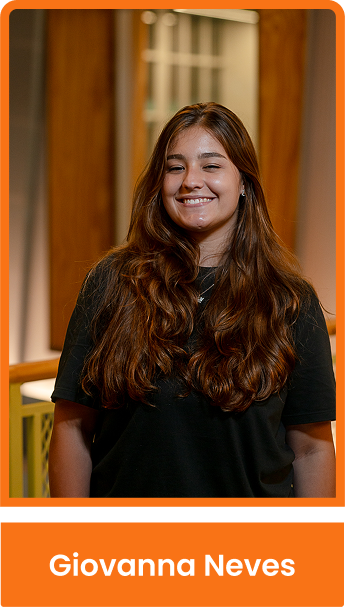
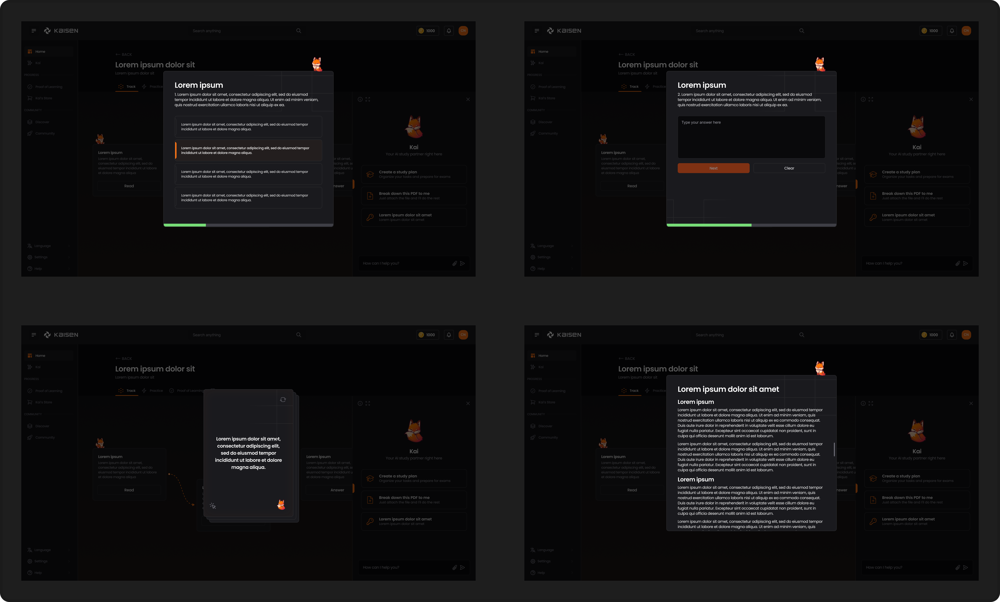
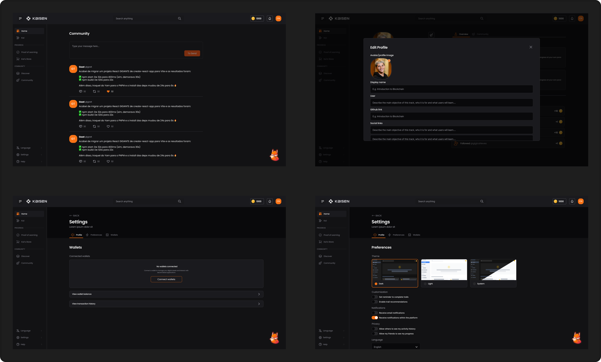
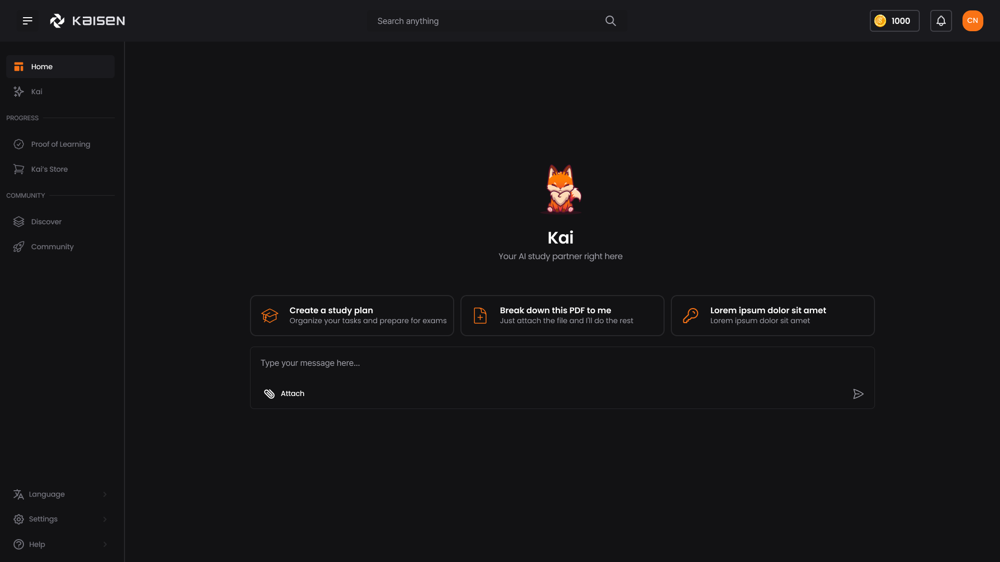

   

<table align="center" style="border: none; border-collapse: collapse;">
  <tr>
    <td style="border: none;"></td>
    <td style="border: none; padding: 1;"></td>
    <td style="border: none; padding: 1;"></td>
    <td style="border: none; padding: 1;"></td>
    <td style="border: none; padding: 1;"></td>
  </tr>
</table>

## Table of Contents

  
<a href="#1-introduction">1. Introduction</a>

  
<a href="#2-application-overview">2. Application Overview</a>

  <ul>
    <li>
      <a href="#21-project-scope">2.1. Project Scope</a>
      <ul>
        <li><a href="#211-porter-5-forces-model">2.1.1. Porter's 5 Forces Model</a></li>
        <li><a href="#212-swot-analysis-of-partner-institution">2.1.2. SWOT Analysis of Partner Institution</a></li>
        <li><a href="#213-solution">2.1.3. Solution</a></li>
        <li><a href="#214-value-proposition-canvas">2.1.4. Value Proposition Canvas</a></li>
        <li><a href="#215-project-risk-matrix">2.1.5. Project Risk Matrix</a></li>
      </ul>
    </li>
    <li><a href="#22-personas">2.2. Personas</a></li>
  </ul>

  
<a href="#3-application-project">3. Application Project</a>

  <ul>
    <li><a href="#31-architecture-diagram">3.1. Architecture Diagram</a></li>
    <li><a href="#32-style-guide">3.2. Style Guide</a></li>
    <ul>
      <li><a href="#321-colors">3.2.1. Colors</a></li>
      <li><a href="#322-typography">3.2.2. Typography</a></li>
      <li><a href="#323-iconography-and-images">3.2.3. Iconography and Images</a></li>
    </ul>
    <li><a href="#33-high-fidelity-prototype">3.3. High-Fidelity Prototype</a></li>
    <li><a href="#34-data-modeling-on-chain">3.4. Data Modeling (On-Chain)</a></li>
    <ul>
      <li><a href="#341-smart-contracts-logic-on-chain">3.4.1. Smart Contracts Logic (On-Chain)</a></li>
    </ul>
  </ul>

  
<a href="#4-application-development">4. Application Development</a>

  <ul>
    <li><a href="#41-first-version-of-the-application-mvp">4.1. First Version of the Application (MVP)</a></li>
  </ul>

  
<a href="#5-market-study-and-marketing-plan">5. Market Study and Marketing Plan</a>

  <ul>
    <li><a href="#51-executive-summary">5.1. Executive Summary</a></li>
    <li><a href="#52-market-analysis">5.2. Market Analysis</a></li>
    <li><a href="#53-competitive-analysis">5.3. Competitive Analysis</a></li>
    <li><a href="#54-target-audience">5.4. Target Audience</a></li>
    <li><a href="#55-positioning">5.5. Positioning</a></li>
    <li><a href="#56-marketing-strategy">5.6. Marketing Strategy</a></li>
  </ul>

  
<a href="#6-conclusions-and-future-work">6. Conclusions and Future Work</a>

  
<a href="#7-references">7. References</a>

  
<a href="#8-appendices">8. Appendices</a>

# 1. Introduction

Kaizen is a decentralized educational platform that transforms the way individuals learn, share, and validate knowledge. By integrating artificial intelligence and blockchain technology, the application offers an innovative and continuous experience in which the user not only studies in a personalized way but also publicly proves their progress through immutable digital certifications.

In practice, the process begins when the user sends content such as PDFs, notes, or articles directly to Kai—the platform's intelligent virtual assistant. From this material, Kai generates interactive flashcards, quizzes, summaries, and personalized study paths, facilitating targeted and efficient learning. Upon completing their study journey, the user can validate the knowledge acquired through an NFT certificate, which reliably and transparently attests to their mastery of the studied content.

In addition, Kaizen promotes knowledge sharing, where the user, after completing their paths, can make them publicly available with the content they studied, allowing other people to benefit from the path taken. To further enrich this exchange, community members can suggest complementary materials to existing trails, while the trail creator maintains the autonomy to accept all, some, or none of the contributions. This promotes active curation and ensures the quality of shared resources.

Aiming to encourage constant engagement, the application rewards users for each significant interaction—whether it be answering a question correctly, completing a trail, or contributing relevant content. These accumulated tokens can be used in Kai's Shop, an interactive and playful environment where it is possible to unlock variations of the mascot (with personalized looks and skins), as well as exclusive tools that enhance learning and the creation of new content.

In this way, Kaizen establishes itself as an intelligent and collaborative study environment—in which each achievement is recorded, each contribution is valued, and knowledge is transformed into digital reputation, social recognition, and tangible rewards.

# 2. Application Overview

## 2.1. Project Scope

### 2.1.1. Porter's 5 Forces Model

The education industry faces growing challenges, such as the low quality of teaching and the difficulty of reliably proving learning. According to UNESCO, millions of young people still do not have access to adequate education, while the job market evolves rapidly and demands constant professional development. In addition, the lack of effective means—digital or physical—to validate knowledge hinders the advancement of many individuals.

In this context, Kaizen emerges as an innovative solution by combining artificial intelligence and blockchain to personalize learning and ensure the secure validation of knowledge through immutable digital certificates (NFTs). By facilitating learning, transparent certification, and collaborative sharing, Kaizen offers an effective alternative to the limitations of the traditional education model, expanding access and trust in the educational process.

In this scenario, Porter's Five Forces analysis is applied—an essential tool for assessing the competitive environment and understanding the factors that influence the dynamics of the sector.

Figure 1 - Porter's 5 Forces Model

Source: Material produced by the authors (2025)

**Competitor Rivalry – High** 
The online education platform market is booming, driven by giants such as Coursera, Udemy, Duolingo, and Khan Academy, which reach millions of users around the world. This diversity of alternatives increases the competition for attention and engagement. To differentiate itself in this scenario, Kaizen adopts a unique proposal: it combines personalized artificial intelligence with immutable validation of knowledge via blockchain. This approach creates a qualitative barrier that reduces the direct impact of traditional competition and positions the platform as a reference in educational innovation.

**Threat of new entrants – Moderate** 
The threat of new entrants is moderate because, despite the ease of entry into the digital sector, developing a platform that integrates AI, blockchain, gamification, and knowledge validation requires technical expertise, investment in infrastructure, and educational credibility. These requirements create technological and trust barriers, thus making it difficult for new participants with similar proposals to enter and protecting the position of the Kaizen platform in the market.

**Threat of substitute products – High** 
The threat of substitute products is high, as users may opt for informal solutions, such as YouTube videos, e-books, forums, or free podcasts. These alternatives, although accessible, lack pedagogical structure, valid certification, and engagement mechanisms. To overcome this scenario, the Kaizen platform relies on a personalized learning journey based on artificial intelligence and the immutable validation of knowledge through NFTs—a significant differentiator that is not easily replicable by traditional or informal substitutes.

**Bargaining power of customers – High** 
Given the wide range of free or low-cost educational resources available, users have a high level of choice and demand clear value in their decisions. To reduce this pressure, Kaizen invests in the user experience by offering a gamified, transparent platform focused on digital reputation through certified NFTs. This value proposition strengthens loyalty, increases engagement, and transforms the user into an active agent in their own educational development.

**Supplier Bargaining Power – Moderate** 
Dependence on external technological infrastructure and tools—such as AI APIs and blockchain networks—can increase suppliers’ bargaining power and impact operating costs. To mitigate this risk, Kaizen adopts a service decentralization strategy, prioritizing scalable, interoperable solutions that allow flexibility in choosing partners. With this, the platform ensures technical autonomy and greater resilience in the face of fluctuations in the supplier market.

### 2.1.2. SWOT Analysis of Partner Institution

The SWOT analysis is a widely used tool for planning and mapping out various solutions. It helps in understanding how a company, brand, product, or service positions itself in the market by identifying its strengths and weaknesses (internal factors), as well as opportunities and threats (external factors). Below is the analysis of the developed solution.

Figure 2 - Swot Analysis Model

Source: Material produced by the authors (2025)

**Strengths:** 

- Unique integration of AI, gamification, and NFTs.
- True learning personalization through an intelligent assistant.
- Decentralized and transparent knowledge validation.
- Digital reputation system.
- Active and collaborative community.
- Multidisciplinary team with a strong technological vision.

**Weaknesses:** 

- Limited financial and technical resources.
- Adoption curve of the chosen technologies (AI, NFT, Web3).
- Lack of initial traction and market validation.
- Risk of dependency on third-party technologies (e.g., blockchain networks, third-party AIs).
- Absence of institutional support or formally recognized certification.

**Opportunities:** 

- Expansion of decentralized education.
- Growth of peer-to-peer learning communities.
- Increasing interest in self-directed learning.
- Education as a reputational asset (public curriculum).
- Partnerships with innovative platforms and institutions.

**Threats:** 

- Uncertain regulation regarding the use of AI and blockchain.
- Established educational platforms.
- Adoption challenges among users unfamiliar with Web3.
- Saturation of the edtech market (startups and education-focused platforms).
- Potential devaluation of NFT certificates if not externally recognized.

The SWOT analysis of the Kaizen platform highlights a project with high innovative potential, supported by a differentiated value proposition that integrates Artificial Intelligence, gamification, and decentralized validation through NFTs. Its main strengths lie in the personalization of learning, community engagement, and the construction of digital reputation, all aligned with emerging trends in education and Web3.

However, the project faces challenges related to its internal structure and the current maturity level of the market. The lack of initial traction and market validation, combined with the adoption curve of the technologies involved, presents real obstacles to widespread expansion and user acceptance. The limited availability of technical and financial resources, along with the absence of formally recognized institutional certification, reinforces the need for a solid market entry strategy that prioritizes ease of use, real-user testing, and strategic partnerships.

External opportunities are clear, especially with the growing value placed on self-directed learning, digital reputation, and collaborative communities. Nonetheless, the project must overcome threats such as the saturation of the edtech market, skepticism toward technologies like NFTs, and increasing regulatory pressure on AI and blockchain.

Therefore, to ensure the sustainability of the solution, it is essential to validate it within specific niches, modularize its technological complexity, and develop a marketing plan that clearly communicates its unique value in an accessible, user-focused manner.

### 2.1.3. Solution

**Problem to be solved:**   
The traditional educational model is centralized, expensive, and inefficient in providing detailed and verifiable proof of individual knowledge. Furthermore, the certificates currently used are fragile, and learning is treated as a product rather than a collaborative ecosystem. Consequently, there is a lack of effective mechanisms for validating knowledge, as well as limited incentives for sharing and collaboration within the community.

**Available data:**   
The platform offers a wide variety of educational content, available in various formats, such as PDFs, articles, research papers, and technical documentation. Furthermore, relevant data is collected, such as user learning patterns and preferences, community engagement metrics, and blockchain-based validation records. It is worth noting that the platform utilizes both user-generated content and learning materials processed by artificial intelligence (AI), thus creating a comprehensive and dynamic knowledge repository.

**Proposed solution:**   
Kaizen is the first decentralized knowledge protocol that transforms learning—once a passive consumption process—into a creative, collaborative, and valuable experience. The solution combines personalized learning paths with AI technologies and blockchain validation, creating a true “GitHub of Knowledge.”

Users input raw materials (such as PDFs, topics, and links), which are processed by Kai, an AI assistant. Kai, in turn, generates personalized learning paths. These paths can be published, forked, and improved by the community, resulting in a living, constantly evolving repository, validated by NFT certificates and incentivized by the $KOIN token economy.

**How to use the solution:**   
- Content Input: The user submits documents or defines topics of interest to Kai.
- Path Generation: The AI creates personalized paths containing quizzes, flashcards, and interactive content.
- Learning Process: Users progress through the paths with the support of the AI tutor.
- Community Collaboration: Upon completion, paths can be published and improved by the community through forking.
- Validation: Completion of the learning process is certified by “mineable” NFTs, serving as proof of learning.
- Incentive: Users are rewarded with $KOIN tokens for creating quality content, completing paths, and collaborating with the community.

**Expected benefits:**  
- Democratization of access to personalized, AI-driven education.
- Verifiable and portable knowledge credentials, secured by blockchain certificates.
- Creation of a collaborative knowledge ecosystem, with content continuously improved by the community.
- Establishment of a sustainable incentive model that values learning and sharing.
- Reduction of educational costs and expansion of access to education.
- Strengthening digital reputation and professional recognition through certified achievements.

**Success criteria and how it will be evaluated:**  
- User Engagement: Measured by the number of paths created, completed, and forked monthly.
- Community Growth: Assessed based on the number of active users and retention rate (goal: over 5,000 active users in the first year).
- Knowledge Quality: Verified through community reviews and engagement metrics for published tracks.
- Certification Adoption: Quantified by the number of NFT certificates issued and shared in professional contexts.
- Token Economy Health: Monitored based on the circulation of the $KOIN token, adoption of staking mechanisms, and market activity.
- Educational Impact: Assessed by measuring improvements in user knowledge and skills through pre- and post-assessments.

### 2.1.4. Value Proposition Canvas

The Value Proposition Canvas is a strategic tool used by various companies with the objective of deeply understanding the needs, pains, and desires of their customers, while simultaneously aiming to create and position the offered product or service according to those demands. Based on this, the following is the Value Proposition Canvas of the Kaizen solution, which presents a well-defined customer profile and a clear description of how the proposed solution aligns with it.

Figure 3 - Value Proposition Canvas

Source: Material produced by the authors (2025)

**Customer Jobs:** 

- Study autonomously using online content.
- Create and organize their own study materials (summaries, flashcards, learning paths).
- Search for reliable and relevant materials aligned with their goals.
- Officially validate knowledge acquired through informal means.
- Share knowledge and materials with others.
- View their progress and learning history in a clear and personalized way.
- Evaluate and select candidates based on real and evidenced learning journeys.

**Pains:** 

- Lack of free, logically or chronologically organized study content.
- Difficulty finding high-quality, objective materials.
- Absence of a clear and personalized overview of study progress.
- Inability to officially validate informal learning.
- Lack of centralization of study materials across different fields of knowledge.
- Lack of incentive for those who share knowledge with the community.

**Gains:** 

- Creation of a valued digital reputation through an active community.
- Income generation and recognition through created content and learning paths.
- Transparent, trustworthy, and immutable digital certificates that validate knowledge.
- A solid, traceable portfolio for use in selection processes.
- Continuous motivation through gamification and rewards.
- Integrated and clear view of any individual's learning history.

**Products & Services:** 

- Decentralized educational platform integrating AI and blockchain.
- Intelligent virtual assistant (Kai) that transforms any material into flashcards, summaries, quizzes, and personalized study paths.
- Digital certification via NFT with public and immutable validation.
- Public learning paths with possibilities for collaboration and community curation.
- Gamification system with rewards in tokens and cosmetic items.
- Interactive store with customizations and additional tools.
- Traceable educational profile with reputation linked to progress and collaboration.

**Pain Relievers:** 

- Automated and personalized organization of studies based on the user’s own materials.
- Official validation of informal learning without dependence on traditional institutions.
- Clear and continuous visualization of knowledge evolution.
- Tools to centralize and document the entire educational journey.
- Tangible incentives for those who contribute to the community (rewards and reputation).
- Transparency and traceability in recording competencies and learning.

**Gain Creators:** 

- More efficient, personalized, and motivating study experience supported by AI.
- Rewards for every meaningful interaction: studying, creating, contributing.
- Possibility to monetize one’s own educational content.
- Recognition of the educational journey as a reputation-building asset.
- Shareable educational portfolio for recruiters in an objective and reliable format.

The analysis conducted through the Kaizen Value Proposition Canvas demonstrates not only a clear understanding of the target audience’s pains and expectations but also a consistent plan to offer a functional and strategic response to these demands. The proposal is anchored in technological differentiators, such as the integration of AI, blockchain, and NFT certifications. However, the most relevant aspect of the proposal lies in the platform’s ability to convert informal learning into verifiable reputation, a feature still rarely explored consistently in the educational market.

Therefore, it is worth emphasizing that the solution addresses a real and pressing issue: the disconnect between knowledge acquired through non-traditional means and its validation. The centralization of learning data, personalization of the study process, and the possibility of monetizing and sharing educational journeys add direct value to the end user. Kaizen does not merely rely on emerging technologies; it builds an ecosystem in which knowledge is treated as a reputational asset—traceable, shareable, and, most importantly, rewardable.

## 2.2. Personas

Representing specific individuals, personas are semi-fictional profiles built based on real data and observations about the target audience. Their main function is to facilitate the understanding of users' needs, behaviors, and motivations, allowing for more targeted and effective solution development.

Below are three personas developed specifically for this project to guide decision-making and ensure greater alignment with end-user expectations.

Figure 4 - Persona 1

Source: Material produced by the authors (2025)

She represents an ambitious young student from a peripheral community who sees technology as a path to new opportunities. As a technical high school student studying Computer Science in the outskirts of São Paulo, she embodies the self-taught learner, using mobile technology as an ally in her educational journey. Clara's persona highlights the importance of accessible and personalized learning, capable of transforming informal study into recognized credentials—a key challenge for students seeking to demonstrate their competencies beyond traditional academic settings.

Figure 5 - Persona 2

Source: Material produced by the authors (2025)

He personifies the modern self-taught developer who stands out in the Web3 ecosystem. At 23, this junior developer represents a growing community of professionals who have honed their skills through alternative learning paths—such as YouTube tutorials, contributions to open-source projects, and participation in hackathons. His persona highlights the gap between practical knowledge and formal recognition, while also symbolizing the creative economy, in which educational content producers seek to generate impact and monetize their knowledge.

Figure 6 - Persona 3

Source: Material produced by the authors (2025)

She represents the progressive HR professional working in a constantly changing talent landscape, especially in technology startups. As an HR analyst with a background in Psychology, she faces the daily challenge of evaluating candidates whose most relevant skills were often acquired through non-traditional learning paths. Her persona highlights the modern recruiter's dilemma: how to fairly recognize and validate informal learning while developing more inclusive, evidence-based selection processes capable of identifying talent beyond formal educational credentials.

# 3. Application Project

## 3.1. Architecture Diagram

The presented architecture diagram describes the application's technological structure, highlighting the separation between the front-end, back-end (via Internet Computer Canisters), and external integration layers.

Figure 7 - Architecture diagram

Source: Material produced by the authors (2025)

 The front-end uses modern frameworks and libraries such as React, Tailwind, Node.js, TypeScript, JavaScript, and Vite, ensuring a responsive, modular, and efficient interface for client interaction. This layer is responsible for mediating communication between the user and the services offered by the application. 
 
 The back-end is represented by Canisters hosted on the Internet Computer (ICP), which enable decentralization, scalability, and security of the application's operations. Furthermore, there is external integration with Google's Gemini language model, which can be used to provide artificial intelligence-based features. 
 
 This diagram is essential for visualizing the organization of components, facilitating understanding between developers and stakeholders, and guiding technical decisions throughout development.

## 3.2. Style Guide

The Kaizen style guide aims to ensure visual and functional consistency throughout the platform's interface. It serves as a central reference for designers and developers, standardizing the use of colors, typography, and graphic elements. By strengthening Kaizen's visual identity, the guide reduces inconsistencies in interface development and ensures accessibility, aesthetic coherence, and scalability across different application modules—whether they are aimed at individual learning, community validation, or public presentation of acquired knowledge.

### 3.2.1. Colors

The color palette is an essential element in the visual construction of the Kaizen platform, contributing to the clear communication of the application's purpose, reinforcing its values of autonomy, innovation, and decentralization. The colors were chosen based on principles of contrast, accessibility, and visual hierarchy, ensuring an intuitive, functional, and welcoming experience for different user profiles.

Figure 8 - Colors

Source: Material produced by the authors (2025)

The main color of the visual identity is a vibrant shade of orange (#F97316 | orange-500), which evokes energy, creativity, and transformation—core aspects of Kaizen's educational proposal. This color is applied to prominent interactive elements, such as primary buttons, calls to action, and progress markers. Its more intense variation, dark orange (#C2410C | orange-700), is used in contexts where greater emphasis or visual depth is desired, maintaining consistency and dynamism in communication.

The palette also includes a carefully distributed grayscale, ranging from white (#FAFAFA | zinc-50) to black (#09090B | zinc-950). These neutral tones provide balance to the interface, allowing the orange elements to stand out clearly, while ensuring readability and accessibility across devices and viewing modes (such as dark mode).

Each color in the palette serves a strategic purpose—whether as a background, outline, shadow, or text—reinforcing the Kaizen identity and promoting consistent, streamlined navigation focused on continuous learning.

### 3.2.2. Typography

The typography used on the Kaizen platform was selected based on legibility, simplicity, and visual consistency, aiming to provide fluid and accessible reading across different devices and contexts. The Poppins font, available on Google Fonts, was chosen for its clean, modern, and highly legible design.

Figure 9 - Typography

Source: Material produced by the authors (2025)

The use of a single typeface throughout the interface contributes to the design's uniformity, while variations in size, weight, and spacing allow for the creation of a well-defined visual hierarchy. Titles and calls to action use bolder weights, such as SemiBold, in larger sizes (32px and 24px), to highlight relevant information and guide user navigation. Body text, such as descriptions and instructions, uses Regular or Medium weights, with sizes ranging from 14px to 16px and consistent spacing of -2%, promoting comfortable and fluid reading.

By strategically adopting the Poppins font and its variations, Kaizen reinforces its visual identity and provides a consistent, welcoming, and inclusive experience for its entire decentralized learning community.

### 3.2.3. Visual Elements

The visual elements of the Kaizen platform were designed to communicate, symbolically and emotionally, the solution's core values. Notable among these elements are the mascot and logo, which reinforce the platform's identity and foster a closer connection with users.

Figure 10 - Mascot

Source: Material produced by the authors (2025)

The platform's mascot, Kai, is an expressive and welcoming fox, presented in several variations that represent different emotional states and moments in the learning journey—such as studying, relaxing, listening to music, or moving. The choice of this animal evokes attributes such as intelligence, curiosity, and lightheartedness, reflecting the platform's vision of making decentralized learning more human, engaging, and accessible. The mascot's presence contributes to strengthening the emotional connection with users, making the experience more engaging and captivating.

Figure 11 - Logo

Source: Material produced by the authors (2025)

The Kaizen logo, meanwhile, is composed of modular geometric shapes organized around a central block—a key symbol of the platform's visual identity. This central block carries a dual meaning: it represents both the blocks that structure blockchain technology and the knowledge blocks constructed throughout the learning process. It's not a traditional solid shape, like a square or rectangle; rather, it's made up of several parts that connect and evolve.

This fragmented composition symbolizes the collaborative and constantly evolving nature of Kaizen, where users and artificial intelligence work together to organize, validate, and expand knowledge. The logo thus conveys the fundamental pillars of the platform's proposal: decentralization, autonomy, technology, and co-authorship.

Together, the Kai mascot and the logo form a strong, symbolic visual identity that's consistent with the principles of Kaizen—a platform that combines cutting-edge technology with empathy and purpose, transforming the way people learn and share knowledge.

## 3.3. High-Fidelity Prototype

A high-fidelity prototype provides a detailed visual representation of the application. It simulates the design's field format, interactions, and user experience, using colors, typography, icons, buttons, and other graphic elements compatible with the final product.

This type of prototype allows you to validate design decisions before development begins, test usability with real users, and present a solution visually and functionally to interested parties.

The complete prototype can be accessed through the Figma platform, using the following link: [Figma Prototype](https://www.figma.com/design/qPsCtf4GvgwH6cmUgdy7Q8/Kaisen--WCHL-?node-id=11-55&p=f&t=iUgnCTERVnBrP4BJ-0)

Below are the prototyped screens, which illustrate the application's main functionalities:

Figure 12 - Home

Source: Material produced by the authors (2025)

The home screen serves as the platform's central navigation point, offering users a bird's-eye view of their progress and quick access to key features. As the user's first contact with the application, it plays a crucial role in defining the user experience, setting the visual and functional tone for the journey. It displays highlighted learning paths and personalized statistics, facilitating the intuitive discovery of relevant content.

Figure 13 - Chat

Source: Material produced by the authors (2025)

This interface allows direct communication with the platform's artificial intelligence assistant, Kai. Through this channel, users can submit materials, ask questions, and receive personalized educational guidance. This functionality represents the core of Kaizen's value proposition, as it transforms raw content into structured, dynamic, and interactive learning experiences, powered by AI.

Figure 14 - Tracks

Source: Material produced by the authors (2025)

The paths screen organizes and categorizes the content available on the platform, allowing users to navigate different areas of knowledge. It is essential for discovering and organizing learning, offering filtering capabilities by topics, interests, and difficulty levels. This allows users to easily identify which paths best meet their educational needs and objectives.

Figure 15 - Tracks

Source: Material produced by the authors (2025)

Modals provide an in-depth overview of a specific learning path, including its description, user progress, available modules, related content, and supplementary resources. They are essential components for user engagement, as they allow direct access to different types of educational resources, such as flashcards, summaries, quizzes, and videos. Thus, they provide a more dynamic, interactive, and structured learning experience, favoring personalized and efficient knowledge assimilation.

Figure 16 - Practice and Proof of Learning

Source: Material produced by the authors (2025)

In the Practice section, users have access to features that help them review the content studied throughout the path, including quizzes and interactive tests. These resources are essential for consolidating learning and validating individual progress. Upon completing the proposed activities, users unlock the Proof of Learning section, where they can obtain their certificate in NFT format. This certificate is authenticated via blockchain, ensuring its authenticity and immutability. The platform also offers direct sharing options to social media, increasing the visibility of users' achievements and strengthening their digital reputation.

Figure 17 - Discover

Source: Material produced by the authors (2025)

The Discover feature aims to expand learning possibilities by facilitating the exploration of new paths and content through thematic categories, smart filters, and personalized recommendations. This screen is vital for maintaining ongoing user engagement and stimulating curiosity, connecting them to knowledge that might otherwise go unnoticed.

Figure 18 - Profile

Source: Material produced by the authors (2025)

The profile screen provides a comprehensive overview of the user's journey on the platform, gathering information about their progress and activities. Through this interface, users can access tracks in progress and those already completed, as well as view engagement metrics, such as the time spent on each specific track and the total time spent using the platform.

Furthermore, users have access to their earned certifications, allowing them to download certificates in NFT format or share them directly on social media. The screen also displays the tracks they have published, as well as those that have not yet been made publicly available. If desired, users can create new tracks, with editing and deletion capabilities, giving them the autonomy to contribute to the community and personalize their learning journey.

Figure 19 - Kai's store

Source: Material produced by the authors (2025)

Kai's store is a gamified interface where users can use platform tokens ($KOIN) to purchase visual customizations, skins, exclusive features, and premium tools. This is a strategic feature for both monetization and user retention, offering tangible incentives for continued engagement. By enabling personalized experiences, the store also helps strengthen users' emotional bond with the platform.

Figure 20 - settings and community

Source: Material produced by the authors (2025)

The settings screen allows users to adjust their usage preferences, configure notifications, and manage their accounts in a personalized way. This feature offers greater control over the individual experience within the platform, promoting comfort, accessibility, and security during continued use.

The community screen aims to strengthen interactions between users, serving as a space for exchange and collaboration. Here, participants can post about their experiences on the platform, share reflections on the learning process, promote created paths, and interact with other members' content. This dynamic contributes to building a network of support and educational engagement, encouraging mutual recognition and collective development.

# 4. Application Development

## 4.1. First Version of the Application (MVP)

The first version of the Kaizen application MVP has been completed, providing the essential structure of the system, focusing on validating the main usage flows and integrations between the backend and frontend. This initial delivery prioritized user experience, authentication, basic interaction features, and integration with the blockchain layer.

#### Structure and implemented features

In this initial version, the following functional components were delivered:

- **Home page with navigation menu:** Clear interface, with quick access to the main areas of the system.
- **User authentication system:** Implementation of login, logout, and identity management, integrating with the Motoko backend.
- **User profile management:** Creation, viewing, and editing of profiles, including nicknames, bios, and roles.
- **Community dashboard:** Screen for viewing community posts, promoting interaction and engagement among users.
- **AI Chat (Kai):** Intelligent chat functionality, allowing users to initiate conversations with AI, save history, and dynamic responses.
- **User Track Management and Display:** View created, in-progress, and completed tracks for each profile.

#### Technical Development Process

Development combined modern technologies, with a clear division between the React/Vite (TypeScript) frontend and the Motoko backend. Hooks and providers were created for authentication, user management, and integration of operations with Motoko canisters. The AI chat system uses asynchronous requests, contextual history, and interaction persistence.

#### Screen Illustrations
Some of the main screens implemented in this version are:

Figure 21 - Home

Source: Material produced by the authors (2025)

Figure 22 - Tracks

Source: Material produced by the authors (2025)

Figure 23 - Chat

Source: Material produced by the authors (2025)

Figure 24 - Discover

Source: Material produced by the authors (2025)

Figure 25 - Practice

Source: Material produced by the authors (2025)

Figure 26 - Proof of Learning

Source: Material produced by the authors (2025)

#### Challenges Faced

Among the main challenges were the secure integration between the frontend and Motoko canisters, the modeling of the decentralized authentication flow, and the management of conversation status with AI, ensuring real-time updates to the interface and consistency of user data.

This MVP version validates the essential pillars of the Kaizen platform, serving as a solid foundation for continuous evolution and the inclusion of new features in the next stages of the project.

# 5. Market Study and Marketing Plan

Kaizen's market research and marketing plan aim to align the platform's proposal with the audience's real needs, within the context of decentralized digital education. Understanding learning behavior and the competitive landscape allows for strategic positioning of the solution, while the marketing plan guides its communication and promotion, focusing on engagement and brand consolidation.

## 5.1. Executive Summary

Kaizen is a decentralized educational platform that integrates artificial intelligence and blockchain to personalize learning and certify knowledge through NFTs, ensuring authenticity and portability. In a context marked by the growth of informal learning and the lack of reliable validation, Kaizen connects autonomy, recognition, and collaboration, transforming learning into a gamified and accessible experience.

Its distinguishing features include the automatic organization of personalized paths powered by AI, immutable digital certification, a token economy for rewards, and encouraging community co-creation. The platform offers an innovative alternative to traditional educational solutions, democratizing access to digital reputation based on real knowledge.

Its strategic objectives include: (i) personalizing learning based on user content; (ii) promoting public and secure certification; (iii) stimulating collaborative curation; and (iv) transforming learning into a rewarding and meaningful journey.

## 5.2. Market Analysis

### 5.2.1. Industry Overview 

The global EdTech market is growing rapidly, driven by digitalization and the demand for autonomous learning, and is expected to exceed US$400 billion by 2025, according to HolonIQ. In Brazil, the expansion of certifications, self-directed learning, and gamification is a consolidated trend.

The integration of AI with blockchain represents a promising innovation, enabling effective personalization and secure certification. Although still emerging, this model is expected to grow, especially in areas with a high demand for informal recognition, such as technology, design, and continuing education.

### 5.2.2. Market Size and Growth

The Brazilian online education market generated R$1.8 billion in revenue in 2023, with an expected average annual growth of 16% through 2027, according to ABED. Platforms that combine autonomy, gamification, and knowledge validation are expected to gain traction amid dissatisfaction with rigid models and the search for more accessible and meaningful ways to learn.

Furthermore, the educational NFT market is expected to grow as the adoption of decentralized digital credentials increases. IBM and the OECD point out that verifiable digital certificates are one of the main trends in competency validation.

### 5.2.3. Market Trends

Trends directly impacting the Kaizen market include: the validation of informal learning, the strengthening of digital reputation and verifiable portfolios, the advancement of decentralized and self-managed platforms, the appreciation of certifications with professional application, the personalization of teaching through AI, and gamification as an engagement strategy.

## 5.3. Competitive Analysis

**Main Competitors:** 
Kaizen positions itself against several competitors. Direct competitors include platforms such as Coursera, Udemy, and edX, focused on formal online education; Duolingo, with its gamified learning model; and platforms focused on technology and the creative market, such as Platzi, Alura, and Rocketseat. Indirect competitors include platforms such as YouTube, Reddit, Notion, and tools such as GPTs, Obsidian, and Google Keep, which, while not structured learning platforms, are widely used in self-directed learning and personal knowledge building.

**Competitive Advantages of the Web Application:** 
Kaizen's main competitive advantage is its integrated certification model via NFTs—immutable, verifiable, and shareable—combined with AI that structures personalized trails based on users' own content. Furthermore, the token economy as a form of reward, community curation, and a focus on digital reputation, more than just content delivery, solidify its market differentiation.

## 5.4. Target Audience

The Kaizen platform's target audience is primarily young people between the ages of 16 and 35, including students, developers, and freelancers. This group values autonomy in the learning process, seeks formal recognition for informally acquired skills, and is interested in innovative learning methods. Psychographically, these individuals desire flexibility, autonomy, and validation of their skills. Behaviorally, they are familiar with technologies such as AI, Web3, and collaborative digital platforms, which makes them naturally receptive to the Kaizen approach.

## 5.5. Positioning

Kaizen's value proposition is to be the first decentralized educational platform that allows users to create personalized learning paths powered by artificial intelligence, validate their knowledge through NFTs, and share their digital reputation publicly, securely, and transparently. The differentiation strategy centers on inverting the traditional model: instead of relying on pre-formatted content, Kaizen organizes and enhances the knowledge already acquired by the user, transforming this content into a meaningful journey with the help of AI. The NFT certification system and collective curation ensure authenticity, collaboration, and a verifiable reputation for users.

## 5.6. Marketing Strategy

**Product:** 
Kaizen is a gamified educational web platform that integrates artificial intelligence, blockchain, and NFTs. Its main differentiator lies in its ability to create personalized learning paths based on the user's content and interests, transforming knowledge into an interactive and meaningful journey. Furthermore, the platform issues digital certificates in NFT format, offering immutable proof of learning. To strengthen engagement, there is a rewards store with items such as skins and tools that can be purchased through the token economy. Another essential component is the presence of an active, co-authoring community, which contributes to the curation of the paths, validates content, and promotes a collaborative learning experience.

**Price:** 
The platform adopts a freemium business model, offering free access to Kaizen's basic features. Advanced features such as customizations, premium paths, private documents, higher upload limits, and access to advanced AI features ("Kaizen Pro") are unlocked through the platform's token, $KOIN. NFT certification is free for users who complete the tracks, creating an ecosystem that values merit and user engagement without creating financial barriers to learning.

**Place:** 
The platform's distribution will be strategic, with an initial launch in digital communities and innovation hubs focused on technology and education. Kaizen will also seek partnerships with bootcamps, hackathons, technical schools, and initiatives related to the Web3 universe. Presence at technology and education events—both online and in-person—will be essential to promote the platform, establish connections with educators and developers, and attract innovative users willing to experiment with new learning methods.

**Promotion:** 
Kaizen's promotion will focus on content marketing and community engagement. Articles, videos, and posts will be produced on topics such as digital reputation, skills validation, artificial intelligence, and new ways to learn independently. The brand will be present on networks such as Twitter, Telegram, and Discord, where conversations about Web3 and educational technology are most active. Additionally, the platform will partner with influencers from the tech and education worlds, who will be able to share their experiences with Kaizen and boost the brand's credibility. Storytelling campaigns featuring real user stories—showing how Kaizen impacted their learning or career paths—will strengthen the emotional connection with the audience and highlight the transformative value of the proposal.

# 6. Conclusions and Future Work

Kaizen has established itself as an innovative platform for learning and collectively building knowledge pathways in a decentralized environment. Combining modern architecture, blockchain integration, and a focus on user experience, the project allows people to explore and share knowledge in an open, secure, and gamified way.

With the advances achieved to date, Kaizen already offers essential features such as modular content organization, assistive chat, user profiles, and progress tracking. However, the team recognizes the potential for expansion and improvement of the platform, aiming for ambitious goals for future versions.

Among the main focuses of future development is the implementation of a tokenized rewards system, in which users will be rewarded for performing relevant actions on the platform—such as following trails, completing steps, contributing content, and interacting socially. This incentive mechanism aims not only to increase engagement but also to value collaboration and active community participation.

Furthermore, a decentralized governance system is being planned, allowing users to participate in Kaizen's strategic and evolutionary decisions. Through mechanisms that allow the community to directly influence the platform's direction, strengthening the sense of belonging and collective autonomy.

Another planned advancement is the introduction of the path forking functionality—a mechanism inspired by open-source development practices. With this feature, users will be able to create a personal copy (fork) of any public learning path and freely adapt its structure, content, and flow to suit their individual learning objectives or preferred styles. This opens up possibilities for deeper personalization and experimentation, empowering learners to build truly personalized journeys. Once modified, users will have the option to submit their forked version for review or reintegrate it into the original path, fostering a dynamic ecosystem of collaborative refinement. This not only encourages knowledge diversity and co-creation but also helps identify and elevate the most effective learning experiences for the community as a whole.

These advances, combined with the constant pursuit of improvements in usability, accessibility, internationalization, and integration with new protocols, pave the way for Kaizen to become a benchmark in decentralized, collaborative, and future-oriented education. The commitment remains to build an open, democratic, and increasingly meaningful environment for all its users.

# 7. References

IBM. Blockchain in Education Report. 2023. Available at: https://www.ibm.com/downloads/cas/6YVBDQKL. Accessed on: July 03, 2025.

HOLONIQ. Global EdTech Market Outlook 2024. 2024. Available at: https://www.holoniq.com/edtech. Accessed on: July 03, 2025.

DATACAMP. AI in Education: Integrity and Validation Challenges. 2024. Available at: https://www.datacamp.com/pt/blog/ai-in-education. Accessed on: July 03, 2025.

FT MAGAZINE. Artificial Intelligence in Education: Impacts and Challenges. 2024. Available at: https://revistaft.com.br/inteligencia-artificial-na-educacao-impactos-e-desafios/. Accessed on: July 03, 2025.

RNP – NATIONAL EDUCATION AND RESEARCH NETWORK. Artificial intelligence in education: advances and challenges. 2024. Available at: https://www.rnp.br/blog/inteligencia-artificial-na-educacao-avancos-e-desafios/. Accessed on: July 04, 2025.

FRONTIERS IN EDUCATION. Limitations in assessing and formally validating learning outcomes using AI tools. Frontiers in Education, 2024. Available at: https://www.frontiersin.org/journals/education/articles/10.3389/feduc.2024.1501819/full. Accessed on: July 04, 2025.

GONZÁLEZ, R.; MORALES, F. How AI impacts the validation of knowledge. arXiv preprint, 2024. Available at: https://arxiv.org/pdf/2504.06928. Accessed: July 04, 2025.

SMITH, L.; JONES, A. The credibility gap in AI-generated educational content. arXiv preprint, 2024. Available at: https://arxiv.org/pdf/2406.18900. Accessed: July 04, 2025.

TECHTARGET. 8 top blockchain certification courses to pursue. TechTarget, 2023. Available at: https://www.techtarget.com/whatis/feature/8-top-blockchain-certification-courses-to-pursue. Accessed: July 04, 2025.

# 8. Appendices

[FILL IN - Include here any complements to your project, such as diagrams, images, tables, etc.]
